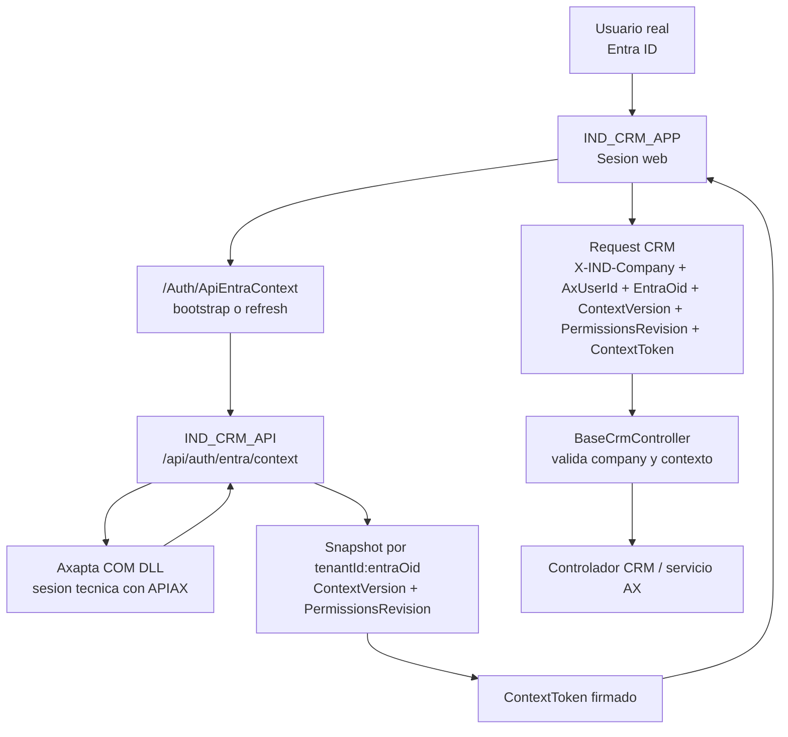

# Arquitectura de autenticacion y aislamiento de contexto por usuario [API + APP]

## Objetivo

Este documento inmortaliza el rediseño de autenticacion y contexto funcional entre:

- `IND_CRM_API`
- `IND_CRM_APP`

El objetivo principal fue resolver de forma robusta el problema de las sesiones y companias que se pisaban entre usuarios, sin perder:

- `APIAX` como cuenta de servicio para la DLL COM de Axapta
- la logica de cambio de `company` en el frontend

Tambien documenta:

- la causa raiz del problema
- la arquitectura final
- los cambios concretos en backend y frontend
- el flujo end-to-end actual
- la comparativa antes vs despues

## Resumen ejecutivo

El problema original no estaba en la autenticacion tecnica contra Axapta. El problema estaba en como se resolvia la autorizacion funcional por compania.

Antes:

- la web guardaba la `company` seleccionada correctamente por sesion
- la API validaba permisos de company contra una cache backend ligada, en la practica, al usuario autenticado de la API
- ese usuario autenticado era la cuenta tecnica `APIAX`
- como `APIAX` era compartido, distintos usuarios reales podian sobrescribir el contexto funcional unos de otros

Despues:

- `APIAX` sigue existiendo y sigue siendo la cuenta de servicio para Axapta COM
- la autorizacion funcional ya no depende de `APIAX`
- el contexto de companias y permisos se liga al usuario real mediante `tenantId + entraOid`
- la web mantiene la `company` seleccionada como estado de sesion propio
- la API valida cada request CRM con un `ContextToken` firmado, `ContextVersion`, `PermissionsRevision` y `X-IND-Company`
- el frontend refresca contexto en silencio cuando detecta `AUTH_CONTEXT_REQUIRED` o `AUTH_CONTEXT_STALE`

## Problema original

### Sintoma visible

Los usuarios podian navegar bien y, de repente, al abrir menus, listados o subordinates, recibir:

- `AUTH_FORBIDDEN`
- `Compania no permitida para el usuario`

El comportamiento parecia aleatorio y afectaba a varios endpoints CRM, no a una sola pantalla.

### Causa raiz

La raiz era una mezcla indebida entre cuatro conceptos distintos:

- autenticacion tecnica en API con `APIAX`
- identidad real del usuario via `EntraOid`
- contexto funcional de companias y permisos
- estado de sesion web con la `company` seleccionada

La web conservaba `INDCompanySelected` correctamente por sesion, pero la API tomaba la autorizacion funcional desde una cache compartida que quedaba asociada al usuario autenticado de la API.

Como ese usuario era `APIAX`, varios usuarios reales compartian la misma referencia funcional backend.

Consecuencia:

- el usuario A podia tener `RSI` seleccionada en su sesion
- el usuario B refrescaba contexto y dejaba otra lista de companies en cache
- el usuario A abria un menu y pasaba a recibir `Compania no permitida para el usuario`

## Objetivos de diseno

Los objetivos no negociables fueron:

- mantener `APIAX` como cuenta de servicio para la DLL COM de Axapta
- separar autenticacion tecnica de autorizacion funcional
- mantener el cambio de `company` del frontend
- impedir la contaminacion cruzada entre usuarios
- distinguir contexto faltante, contexto obsoleto y permiso realmente denegado
- refrescar contexto automaticamente y de forma conservadora
- no meter nueva infraestructura tipo Redis o SQL distribuido
- asumir que la web es el unico consumidor de la API para este flujo

## Principios de arquitectura

1. `APIAX` autentica el canal tecnico, pero no representa al usuario funcional.
2. La identidad real del usuario es `tenantId + entraOid`.
3. El contexto funcional debe viajar firmado y validarse por request.
4. La `company` seleccionada pertenece a la sesion web del usuario.
5. Los errores de contexto deben diferenciarse del permiso realmente denegado.

## Que se mantiene intacto

### `APIAX` sigue siendo la cuenta de servicio

No se elimino ni sustituyo `APIAX`.

`APIAX` sigue usandose para:

- autenticar la web contra la API mediante `ServiceUser / ServicePass`
- abrir la sesion COM de Axapta
- mantener el canal tecnico estable entre `IND_CRM_APP` e `IND_CRM_API`

Lo que cambia es solo esto:

- `APIAX` deja de ser la referencia funcional para decidir si una `company` esta permitida para el usuario real

### El cambio de `company` del frontend se conserva

El selector de `company` del frontend sigue funcionando.

Sigue pasando esto:

- el usuario cambia `company`
- `INDCompanyController.SetCompany(...)` guarda `INDCompanySelected`
- si la `company` cambia, se limpia el contexto cacheado preservando la seleccion
- se fuerza refresh del contexto
- el usuario vuelve a `Home`

La diferencia es que ahora esa seleccion ya no puede romperse porque otro usuario refresque su contexto.

## Arquitectura final

## Flujo end-to-end actual

### 1. Login del usuario real

Cuando el usuario entra por Entra:

- la web obtiene `EntraOid` desde claims
- lo guarda en sesion
- limpia todas las claves de contexto previas para evitar arrastre de estado antiguo

Claves que se limpian:

- `INDWebContext`
- `INDCompanySelected`
- `INDCompanySelectedName`
- `INDCompanySelectionSource`
- `INDEntraOidContext`
- `INDContextToken`
- `INDContextVersion`
- `INDPermissionsRevision`
- `INDContextIssuedUtc`
- `INDContextExpiresUtc`
- `INDContextLastActivityUtc`
- `INDContextTenantId`
- `AxUser`

### 2. Bootstrap del contexto funcional

La web llama a `/Auth/ApiEntraContext`.

Ese proxy termina llamando a `/api/auth/entra/context`, y la API:

- consulta AX mediante la sesion tecnica de `APIAX`
- obtiene `AxUserId`, `DefaultCompany` y la lista de companies del usuario real
- resuelve `tenantId`
- genera `ContextVersion`
- crea o sustituye un snapshot para `tenantId:entraOid`
- calcula una `PermissionsRevision`
- emite un `ContextToken` firmado
- devuelve el contexto completo a la web

### 3. Almacenamiento del contexto en sesion web

La web guarda en sesion:

- `INDWebContext`
- `INDContextToken`
- `INDContextVersion`
- `INDPermissionsRevision`
- `INDContextIssuedUtc`
- `INDContextExpiresUtc`
- `INDContextLastActivityUtc`
- `INDContextTenantId`
- `AxUser`
- la `company` seleccionada o la default que corresponda

### 4. Requests CRM normales

Cada request CRM envia:

- `Authorization: Bearer ...`
- `X-IND-Company`
- `X-IND-AxUserId`
- `X-IND-EntraOid`
- `X-IND-Context-Version`
- `X-IND-Permissions-Revision`
- `X-IND-Context-Token`

### 5. Validacion en API

`BaseCrmController`:

- valida que exista `X-IND-Company`
- valida que exista contexto suficiente
- resuelve el snapshot mas reciente para `tenantId:entraOid`
- valida `ContextToken`
- compara `tenantId`, `EntraOid`, `ContextVersion` y `PermissionsRevision`
- valida que la `company` pedida exista dentro del conjunto permitido

### 6. Si el contexto no es valido

La API devuelve:

- `AUTH_CONTEXT_REQUIRED`: falta bootstrap de contexto
- `AUTH_CONTEXT_STALE`: el contexto expiro o quedo desincronizado
- `AUTH_FORBIDDEN`: la `company` no esta permitida realmente

### 7. Reaccion del frontend

El frontend React:

- detecta `AUTH_CONTEXT_REQUIRED` o `AUTH_CONTEXT_STALE`
- hace refresh silencioso con `POST /Auth/ApiEntraContext`
- reintenta la request una sola vez
- si no recupera contexto, fuerza relogin

## Cambios aplicados en backend (`IND_CRM_API`)

### 1. Snapshot por usuario real

Archivo:

- `Helpers/UserCompanyAccessCache.cs`

Cambios:

- la cache pasa a indexarse por `tenantId:entraOid`
- se introducen campos como:
  - `SnapshotKey`
  - `TenantId`
  - `EntraOid`
  - `AxUserId`
  - `DefaultCompany`
  - `AppCode`
  - `ContextVersion`
  - `PermissionsRevision`
  - `IssuedUtc`
  - `ExpiresUtc`
  - `Companies[]`
- `PermissionsRevision` se calcula con SHA256 a partir de la huella funcional del usuario
- el TTL por defecto del snapshot queda en `30` minutos si no se configura otra cosa

### 2. `ContextToken` firmado

Archivo:

- `Helpers/UserContextTokenService.cs`

Cambios:

- nuevo token firmado especifico para contexto funcional
- usa claims propios:
  - `ind_token_use=context_snapshot`
  - `ind_tenant_id`
  - `ind_entra_oid`
  - `ind_ax_user_id`
  - `ind_app_code`
  - `ind_context_version`
  - `ind_permissions_revision`
  - `ind_default_company`
  - `ind_snapshot_key`
  - `ind_companies`
- valida:
  - issuer y audience de contexto
  - tenant esperado
  - `EntraOid` esperado
  - `ContextVersion` esperada
  - `PermissionsRevision` esperada
  - expiracion
  - desactualizacion respecto al snapshot mas reciente
  - pertenencia de la `company` solicitada

### 3. Endurecimiento de `BaseCrmController`

Archivo:

- `Controllers/CRM/BaseCrmController.cs`

Cambios:

- `RequireCompanyOrReturn422(...)` ahora valida:
  - `X-IND-Company`
  - `X-IND-EntraOid`
  - `X-IND-Context-Version`
  - `X-IND-Permissions-Revision`
  - `X-IND-Context-Token`
- devuelve errores explicitos:
  - `AUTH_CONTEXT_REQUIRED`
  - `AUTH_CONTEXT_STALE`
  - `AUTH_FORBIDDEN`

### 4. Ampliacion de `/api/auth/entra/context`

Archivos:

- `Controllers/System/AuthController.cs`
- `Contracts/Responses/EntraContextDto.cs`

Campos nuevos:

- `TenantId`
- `EntraOid`
- `ContextVersion`
- `PermissionsRevision`
- `ContextIssuedUtc`
- `ContextExpiresUtc`
- `ContextToken`

### 5. Nuevos codigos de error

Archivo:

- `Models/Responses/INDErrorCodes.cs`

Nuevos codigos:

- `AUTH_CONTEXT_REQUIRED`
- `AUTH_CONTEXT_STALE`

### 6. Configuracion nueva

Archivo:

- `App.config`

Claves nuevas:

- `ContextTokenSettings:Issuer`
- `ContextTokenSettings:Audience`
- `ContextTokenSettings:SecretKey`

Scripts ajustados:

- `scripts/set-indcrm-machine-env.ps1`
- `scripts/set-indcrm-machine-all-env.ps1`

## Cambios aplicados en frontend / web (`IND_CRM_APP`)

### 1. Servicio central de contexto

Archivo:

- `App/Services/IndAuthContextService.cs`

Cambios:

- `EnsureContextAsync(bool forceRefresh = false)` pasa a ser el punto central del bootstrap y refresh
- guarda y restaura:
  - `ContextToken`
  - `ContextVersion`
  - `PermissionsRevision`
  - expiracion
  - ultima actividad
- si cambia `EntraOid`, limpia el contexto cacheado
- si el contexto expira o queda inactivo mucho tiempo, fuerza refresh
- expone `ErrorCode`

### 2. Middleware de refresh

Archivo:

- `App/Middleware/IndContextRefreshMiddleware.cs`

Funcion:

- comprueba si el contexto necesita refresh por inactividad o proximidad a expiracion
- intenta refrescarlo antes de que el usuario choque con un error en pantalla

### 3. Configuracion web de refresh

Archivo:

- `App/Models/Shared/ContextSessionSettings.cs`

Valores por defecto:

- `IdleRefreshMinutes = 20`
- `RefreshBeforeExpiryMinutes = 5`

### 4. Limpieza completa en sign-in

Archivo:

- `Program.cs`

Cambio:

- en cada sign-in de Entra se limpian todas las claves de contexto y `company` para evitar sesiones zombie

### 5. Nuevos headers desde la web

Archivo:

- `App/Services/ApiClientService.cs`

Headers enviados ahora:

- `X-IND-Company`
- `X-IND-AxUserId`
- `X-IND-EntraOid`
- `X-IND-Context-Version`
- `X-IND-Permissions-Revision`
- `X-IND-Context-Token`

Importante:

- `X-IND-Company` sigue viniendo de `INDCompanySelected`
- `X-IND-AxUserId` sigue viajando porque AX lo necesita

### 6. Preservacion del cambio de `company`

Archivo:

- `Web/Controllers/System/INDCompanyController.cs`

Flujo:

- guarda la nueva `company`
- si cambia, limpia el contexto preservando la seleccion
- fuerza `EnsureContextAsync()`
- redirige a `Home`

### 7. Reaccion MVC y React por `ErrorCode`

Archivos clave:

- `Web/Controllers/System/AuthController.cs`
- `App/Infrastructure/Security/Filters/INDModuleAuthorizeFilter.cs`
- `Web/Controllers/Gastos/GastosController.cs`
- `Web/wwwroot/react/src/services/apiService.ts`

Cambios:

- se interpreta el fallo por `ErrorCode`, no solo por texto
- React hace refresh silencioso y retry controlado
- solo fuerza relogin si el refresh no recupera el contexto

## Headers actuales

| Header | Origen | Uso |
| --- | --- | --- |
| `Authorization: Bearer ...` | Web -> API | Autenticacion tecnica contra la API |
| `X-IND-Company` | Sesion web | `company` seleccionada por el usuario |
| `X-IND-AxUserId` | Contexto web | Usuario AX efectivo |
| `X-IND-EntraOid` | Sesion web | Identidad real del usuario |
| `X-IND-Context-Version` | Sesion web | Version del contexto emitido por API |
| `X-IND-Permissions-Revision` | Sesion web | Huella estable de permisos/companias |
| `X-IND-Context-Token` | Sesion web | Token firmado del contexto funcional |

## Claves principales de sesion web

| Clave | Uso |
| --- | --- |
| `INDWebContext` | Contexto Entra/AX serializado |
| `INDCompanySelected` | `company` activa elegida por el usuario |
| `INDCompanySelectionSource` | Origen de la seleccion |
| `INDContextToken` | Token firmado del contexto |
| `INDContextVersion` | Version del contexto vigente |
| `INDPermissionsRevision` | Revision estable de permisos |
| `INDContextIssuedUtc` / `INDContextExpiresUtc` | Ventana temporal del contexto |
| `INDContextLastActivityUtc` | Ultima actividad para refresh |
| `INDContextTenantId` | Tenant del contexto actual |
| `AxUser` | Usuario AX efectivo |
| `ENTRAOID` | OID real del usuario autenticado |

## Antes vs despues

| Area | Antes | Ahora | Resultado |
| --- | --- | --- | --- |
| Identidad para autorizacion | En la practica, `APIAX` | `tenantId + entraOid` | Se elimina la contaminacion cruzada |
| Cache de companias | Compartida funcionalmente por la cuenta tecnica | Snapshot por usuario real | Cada usuario tiene su propio contexto |
| `company` seleccionada | Correcta en sesion, pero podia quedar invalidada por backend | Sigue en sesion y se revalida con contexto propio | Se conserva el UX del selector |
| Contrato CRM | `X-IND-Company` + `X-IND-AxUserId` + cache backend | Contexto firmado + version + revision + company | Validacion mas robusta y trazable |
| Deteccion de errores | Muy dependiente de mensajes | `AUTH_CONTEXT_REQUIRED`, `AUTH_CONTEXT_STALE`, `AUTH_FORBIDDEN` | Menos heuristica |
| Refresh del contexto | Mas dependiente de navegar o reloguear | Middleware + refresh preventivo + retry silencioso | Menos errores visibles |
| Seguridad del contexto | Sin separacion formal | Token de contexto separado del bearer | Mejor aislamiento conceptual |
| Nuevo login | Podia arrastrar estado previo | Limpieza completa de claves de contexto | Menos estado zombie |

## Problema concreto que queda resuelto

El problema que se buscaba resolver era este:

- un usuario navegaba con una `company` valida
- otro usuario refrescaba su contexto
- el primero, sin hacer nada incorrecto, empezaba a recibir `Compania no permitida para el usuario`

Con la arquitectura nueva eso deja de pasar por una razon estructural:

- la API ya no usa una referencia funcional compartida por `APIAX`
- cada request se valida contra un snapshot/token del usuario real
- por tanto, el contexto funcional del usuario A no puede ser sobrescrito por el del usuario B

## Decisiones de diseno importantes

### 1. No se metio nueva infraestructura

No se introdujo Redis, SQL distribuido ni otro store central.

Motivo:

- se priorizo una solucion robusta dentro de la topologia actual
- la web es el unico consumidor confirmado de la API
- el objetivo principal era eliminar la contaminacion cruzada sin rehacer toda la plataforma

### 2. Se mantuvo `APIAX`

Se preservo porque:

- es la cuenta de servicio valida para la DLL COM de Axapta
- forma parte del canal tecnico existente
- el problema no era `APIAX` como cuenta tecnica, sino como identidad funcional compartida

### 3. Se separo autenticacion tecnica de autorizacion funcional

Resultado:

- el bearer autentica la aplicacion web contra la API
- el `ContextToken` representa el estado funcional del usuario real
- `X-IND-Company` representa la seleccion de `company` de esa sesion concreta

## Consideraciones operativas

- el snapshot backend sigue teniendo TTL, por defecto `30` minutos
- la web mitiga esto con refresh por inactividad y antes de expiracion
- el contexto se reconstruye al relogin
- la API compara tambien la `PermissionsRevision` del token con la del snapshot mas reciente para detectar desactualizacion

## Validacion realizada durante la implantacion

### Backend API

- se modificaron contratos, validaciones y configuracion
- la build completa en la maquina de trabajo seguia limitada por un requisito externo de Axapta (`AxImp.exe` en `ResolveComReferences`)
- ese bloqueo era previo y externo al rediseño funcional

### Frontend / web

- `dotnet build` correcto
- `npm run check:types` correcto
- `react-doctor` correcto

## Ficheros principales tocados

### API

- `App.config`
- `Contracts/Responses/EntraContextDto.cs`
- `Controllers/CRM/BaseCrmController.cs`
- `Controllers/System/AuthController.cs`
- `Helpers/UserCompanyAccessCache.cs`
- `Helpers/UserContextTokenService.cs`
- `Models/Responses/INDErrorCodes.cs`
- `scripts/set-indcrm-machine-env.ps1`
- `scripts/set-indcrm-machine-all-env.ps1`

### APP / web

- `Program.cs`
- `App/Middleware/IndContextRefreshMiddleware.cs`
- `App/Models/Shared/ContextSessionSettings.cs`
- `App/Models/Shared/IndWebContext.cs`
- `App/Services/IIndAuthContextService.cs`
- `App/Services/IndAuthContextService.cs`
- `App/Services/ApiClientService.cs`
- `App/Infrastructure/Security/Filters/INDModuleAuthorizeFilter.cs`
- `Web/Controllers/System/AuthController.cs`
- `Web/Controllers/System/INDCompanyController.cs`
- `Web/Controllers/Gastos/GastosController.cs`
- `Web/wwwroot/react/src/services/apiService.ts`

## Commits de referencia

- API: `294492b`
- APP: `67cc066`

## Conclusion

Este cambio no es un parche puntual. Es un rediseño controlado de la frontera entre:

- autenticacion tecnica
- identidad real del usuario
- contexto funcional de permisos
- estado de sesion de la UI

La mejora mas importante es conceptual:

- antes, distintos usuarios reales podian quedar mezclados funcionalmente por el uso compartido de `APIAX`
- ahora, cada usuario queda aislado por su propio `tenantId + entraOid`, con un contexto firmado, versionado y revalidado

Eso hace el sistema mucho mas predecible, mas analizable y bastante mas robusto frente al problema que motivo toda esta intervencion: las sesiones y companias que se pisaban entre usuarios.
