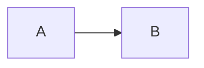

# Architecture diagrams

This folder documents communication flows between `IND_CRM_APP`,
`IND_CRM_API`, Axapta 3.0 through Business Connector COM, and external
services used by CRM modules.

The structure is organized by audience first and then by process:

- `diagrams/technical`: technical diagrams for developers and architects.
- `diagrams/user`: user-level diagrams for business or non-technical readers.
- `assets/technical`: exported technical SVG/PNG images.
- `assets/user`: exported user-level SVG/PNG images.

Items not proven by code are marked as `pendiente de validar`.

## Official Structure

```text
docs/architecture/
  README.md
  export-diagrams.ps1
  diagrams/
    README.md
    technical/
      README.md
      context/
      integration/
      auth/
      expenses/
      tickets/
      ai/
      errors/
    user/
      README.md
      expenses/
      tickets/
      ai/
  assets/
    technical/
      context/
      integration/
      auth/
      expenses/
      tickets/
      ai/
      errors/
    user/
      expenses/
      tickets/
      ai/
```

Each diagram keeps its Markdown explanation and Mermaid source together:

```text
diagrams/technical/ai/ticket-image-ai-sequence.md
diagrams/technical/ai/ticket-image-ai-sequence.mmd
```

## Technical Index

| Process | Document | Mermaid source | Exported SVG |
| --- | --- | --- | --- |
| Context | [system-context.md](diagrams/technical/context/system-context.md) | [system-context.mmd](diagrams/technical/context/system-context.mmd) | [system-context.svg](assets/technical/context/system-context.svg) |
| Integration | [integration-overview.md](diagrams/technical/integration/integration-overview.md) | [integration-overview.mmd](diagrams/technical/integration/integration-overview.mmd) | [integration-overview.svg](assets/technical/integration/integration-overview.svg) |
| Integration | [data-flow.md](diagrams/technical/integration/data-flow.md) | [data-flow.mmd](diagrams/technical/integration/data-flow.mmd) | [data-flow.svg](assets/technical/integration/data-flow.svg) |
| Auth | [auth-context-sequence.md](diagrams/technical/auth/auth-context-sequence.md) | [auth-context-sequence.mmd](diagrams/technical/auth/auth-context-sequence.mmd) | [auth-context-sequence.svg](assets/technical/auth/auth-context-sequence.svg) |
| Expenses | [expense-sheets-sequence.md](diagrams/technical/expenses/expense-sheets-sequence.md) | [expense-sheets-sequence.mmd](diagrams/technical/expenses/expense-sheets-sequence.mmd) | [expense-sheets-sequence.svg](assets/technical/expenses/expense-sheets-sequence.svg) |
| Expenses | [expense-sheet-line-create-edit-flow.md](diagrams/technical/expenses/expense-sheet-line-create-edit-flow.md) | [expense-sheet-line-create-edit-flow.mmd](diagrams/technical/expenses/expense-sheet-line-create-edit-flow.mmd) | [expense-sheet-line-create-edit-flow.svg](assets/technical/expenses/expense-sheet-line-create-edit-flow.svg) |
| Tickets | [tickets-sequence.md](diagrams/technical/tickets/tickets-sequence.md) | [tickets-sequence.mmd](diagrams/technical/tickets/tickets-sequence.mmd) | [tickets-sequence.svg](assets/technical/tickets/tickets-sequence.svg) |
| AI | [ai-audio-transcription-sequence.md](diagrams/technical/ai/ai-audio-transcription-sequence.md) | [ai-audio-transcription-sequence.mmd](diagrams/technical/ai/ai-audio-transcription-sequence.mmd) | [ai-audio-transcription-sequence.svg](assets/technical/ai/ai-audio-transcription-sequence.svg) |
| AI | [ticket-image-ai-sequence.md](diagrams/technical/ai/ticket-image-ai-sequence.md) | [ticket-image-ai-sequence.mmd](diagrams/technical/ai/ticket-image-ai-sequence.mmd) | [ticket-image-ai-sequence.svg](assets/technical/ai/ticket-image-ai-sequence.svg) |
| Errors | [error-handling.md](diagrams/technical/errors/error-handling.md) | [error-handling.mmd](diagrams/technical/errors/error-handling.mmd) | [error-handling.svg](assets/technical/errors/error-handling.svg) |

## User-Level Index

| Process | Document | Mermaid source | Exported SVG |
| --- | --- | --- | --- |
| Expenses | [expense-sheets.md](diagrams/user/expenses/expense-sheets.md) | [expense-sheets.mmd](diagrams/user/expenses/expense-sheets.mmd) | [expense-sheets.svg](assets/user/expenses/expense-sheets.svg) |
| Expenses | [expense-sheet-line-create-edit-flow.md](diagrams/user/expenses/expense-sheet-line-create-edit-flow.md) | [expense-sheet-line-create-edit-flow.mmd](diagrams/user/expenses/expense-sheet-line-create-edit-flow.mmd) | [expense-sheet-line-create-edit-flow.svg](assets/user/expenses/expense-sheet-line-create-edit-flow.svg) |
| Tickets | [tickets.md](diagrams/user/tickets/tickets.md) | [tickets.mmd](diagrams/user/tickets/tickets.mmd) | [tickets.svg](assets/user/tickets/tickets.svg) |
| AI | [ai-audio-transcription.md](diagrams/user/ai/ai-audio-transcription.md) | [ai-audio-transcription.mmd](diagrams/user/ai/ai-audio-transcription.mmd) | [ai-audio-transcription.svg](assets/user/ai/ai-audio-transcription.svg) |
| AI | [ticket-image-ai.md](diagrams/user/ai/ticket-image-ai.md) | [ticket-image-ai.mmd](diagrams/user/ai/ticket-image-ai.mmd) | [ticket-image-ai.svg](assets/user/ai/ticket-image-ai.svg) |

## Viewing Diagrams

GitHub renders Mermaid diagrams directly from fenced Markdown blocks:

````text

````

Open any Markdown file in `diagrams/technical` or `diagrams/user` to view the
diagram without generated images. Use `assets` when a tool needs SVG or PNG.

## Exporting Diagrams

Recommended: install Mermaid CLI once on the machine:

```powershell
npm install -g @mermaid-js/mermaid-cli
```

If `mmdc` is not installed globally, the export script can also use `npx`
when Node/npm are available.

Export all `.mmd` files to SVG:

```powershell
.\docs\architecture\export-diagrams.ps1
```

Export SVG and PNG:

```powershell
.\docs\architecture\export-diagrams.ps1 -Format both
```

PNG only:

```powershell
.\docs\architecture\export-diagrams.ps1 -Format png
```

The script does not modify production code. It reads Mermaid sources from
`docs/architecture/diagrams/technical` and `docs/architecture/diagrams/user`,
then writes images under `docs/architecture/assets/technical` and
`docs/architecture/assets/user`.

## Conventions

- Preserve existing project names such as `IND_CRM_APP` and `IND_CRM_API`.
- Keep technical and user-level counterparts synchronized when both exist.
- Do not include secrets, tokens, credentials, tenant identifiers, company ids,
  AX user ids, full environment URLs, or sensitive request bodies.
- Use placeholders such as `Bearer <token>`, `<companyId>`, `<axUserId>`, and
  `<contextToken>` when a value must be mentioned.
- Technical diagrams may mention routes, headers, services, DTOs, envelopes,
  trace ids, and error codes.
- User-level diagrams should use business language and avoid implementation
  details unless they are visible to the user.
- Use `pendiente de validar` when a behavior or contract was not proven from
  current code, API clients, Swagger/OpenAPI, Postman, or Axapta sources.
