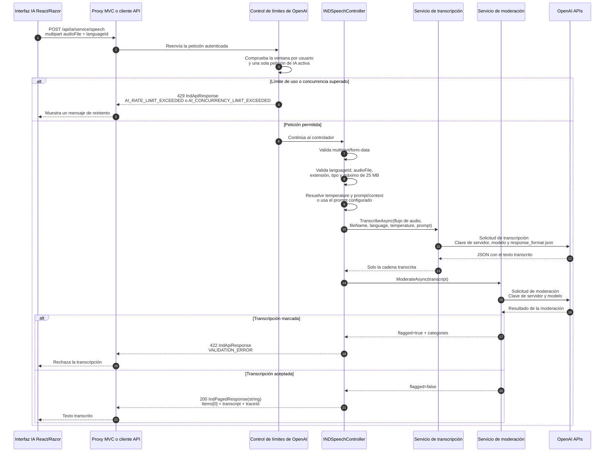

# Secuencia de transcripción de audio con IA

El flujo utiliza OpenAI solo desde el servidor. El navegador nunca recibe las
claves API ni los metadatos originales de OpenAI.

## Contratos observados

- Endpoint: `POST /api/ia/service/speech`.
- Entrada: `multipart/form-data`.
- Campos obligatorios: `languageId` y `audioFile`.
- Campos opcionales: `temperature`, `prompt` o `context`.
- Extensiones admitidas por el código: `.mp3`, `.m4a`, `.wav` y `.flac`.
- Tamaño máximo observado: 25 MB.
- Respuesta correcta: `IndPagedResponse<string>` con el texto en `Items`.
- Los errores de validación o dependencia devuelven `IndApiResponse<T>` con
  `traceId`.

## Comportamiento del servicio

El controlador carga el audio en memoria, valida la petición, obtiene la clave
de OpenAI de la configuración del servidor y llama al servicio de transcripción.
El servicio envía el audio y los parámetros del modelo y devuelve solo el
texto.

Después llama a la moderación de OpenAI. Si no está disponible, registra el
problema y permite continuar como contenido no marcado. Si la moderación marca
el texto, el controlador devuelve un error de validación.

## Límites vigentes

- Los audios grandes se cargan en memoria antes de llamar a OpenAI.
- El control de uso protege `speech` por usuario, ventana y concurrencia.
- No se ha verificado en cada pantalla Razor la ruta de interfaz ni el texto de
  reintento que ve la persona usuaria.
- El modelo y el tiempo de espera dependen de la configuración; no deben
  fijarse en la documentación ni en clientes.
