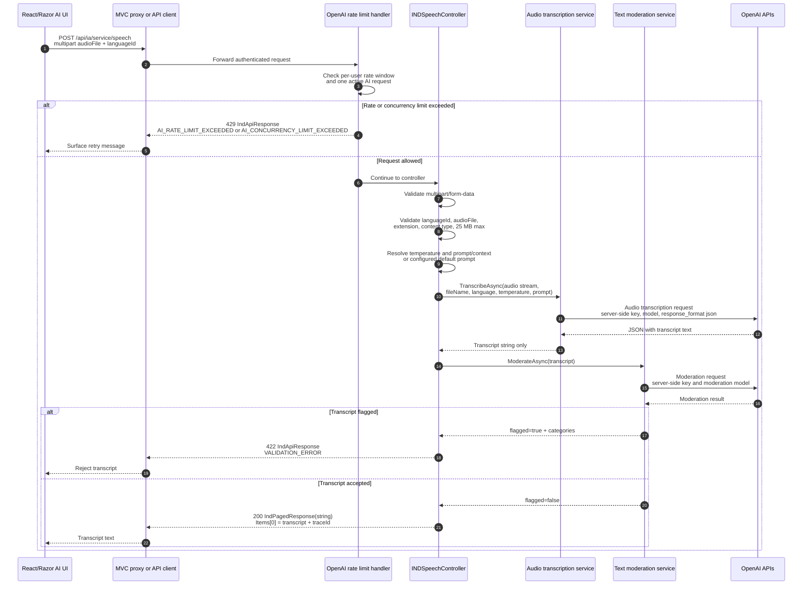

# AI audio transcription sequence

This diagram documents the audio transcription communication path. The flow
uses OpenAI from the server side only; the browser never receives API keys or
OpenAI raw metadata.

## Observed contracts

- Endpoint: `POST /api/ia/service/speech`.
- Input: `multipart/form-data`.
- Required fields: `languageId`, `audioFile`.
- Optional fields: `temperature`, `prompt` or `context`.
- Allowed audio extensions observed in code: `.mp3`, `.m4a`, `.wav`,
  `.flac`.
- Maximum audio size observed in code: 25 MB.
- Success envelope: `IndPagedResponse<string>` with transcript text in
  `Items`.
- Validation or dependency errors return `IndApiResponse<T>` with `traceId`.

## Service behavior

The controller reads the audio into memory, validates the request, obtains the
OpenAI key from server configuration, and calls the audio transcription
service. The service sends the audio and model parameters to OpenAI and
returns only the text field.

After transcription, the controller calls OpenAI moderation. If moderation is
unavailable, the moderation service logs the issue and returns non-flagged, so
the transcription flow can continue. If moderation flags the text, the
controller returns a validation error.

## Risks and pending validation

- Large audio files are read into memory before calling OpenAI.
- The rate-limit handler protects `speech` by user, request window, and
  concurrency.
- Exact UI route and user-facing retry text are pendiente de validar for every
  Razor-only screen.
- The OpenAI model and timeout are configuration-driven and should not be
  hardcoded in docs or clients.
