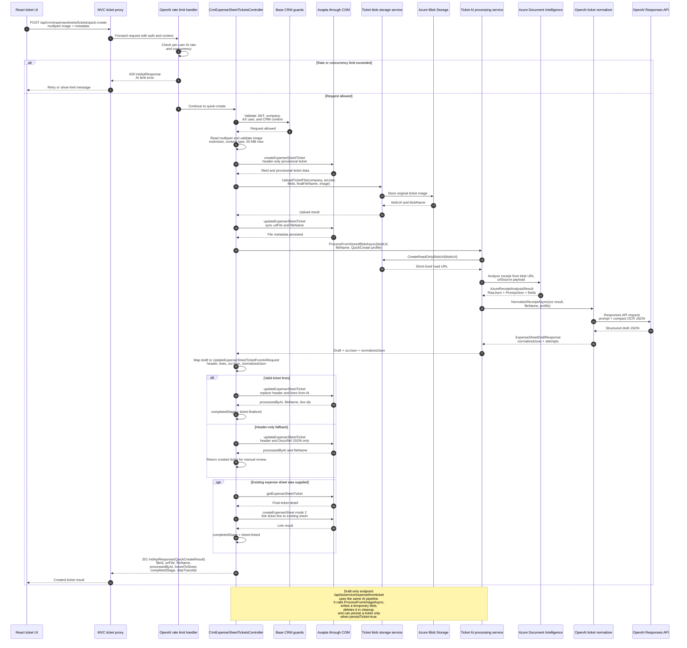

# Ticket image AI sequence

This diagram documents the full ticket image flow used by the quick-create
endpoint. It includes image persistence, Azure Document Intelligence receipt
analysis, OpenAI normalization, mapping into the existing ticket contract, and
Axapta persistence.

## Observed contracts

Primary creation endpoint:

- `POST /api/crm/expensesheets/tickets/quick-create`
- Input: multipart ticket image and optional metadata.
- Required business headers: `Authorization`, `X-IND-Company`,
  `X-IND-AxUserId`, and CRM context headers.
- Success envelope: `IndApiResponse<ExpenseSheetTicketQuickCreateResultDto>`.
- Result fields observed: `FileId`, `UrlFile`, `FileName`,
  `ProcessedByAI`, `LinkedToSheet`, `HojaGastosId`, `CompletedStage`,
  `StepTraceIds`.

Draft-only endpoint using the same AI pipeline:

- `POST /api/ia/service/expensefromticket`
- Input: `ticketImage`, optional `persistTicket`, optional `ticketUrlFile` or
  `urlFile`.
- Success envelope: `IndApiResponse<ExpenseSheetDraftResponse>`.
- Draft fields inherit the expense-sheet creation shape and add `gastoType`,
  `transDate`, `Confidence`, `Warnings`, `RawCurrency`, `Merchant`, and
  optional `TicketCreation`.

## Internal contract mapping

Azure Document Intelligence returns a structured receipt result represented by
`AzureReceiptAnalysisResult`. The relevant server-side fields are:

- `RawJson`: original OCR payload kept for audit/persistence.
- `PromptJson`: compact OCR JSON passed to OpenAI.
- `MerchantName`, `TransactionDate`, `CurrencyCode`, `RawCurrency`,
  `TotalAmount`, `ItemCount`, `Warnings`, and `CurrencyHints`.

OpenAI normalization maps that OCR JSON into `ExpenseSheetDraftResponse` and a
server-side `normalizedJson` string. Quick-create then maps the draft into
`UpdateExpenseSheetTicketFromIARequest` with header fields, ticket lines,
`ocrJson`, `normalizedJson`, file URL, file name, and file extension.

## Side effects

- Quick-create creates a provisional Axapta ticket before image upload.
- The ticket image is stored in Azure Blob and then synced back to Axapta
  ticket metadata.
- A short-lived read URL is generated for Azure Document Intelligence.
- OpenAI receives compact OCR JSON, not the original browser upload.
- The final Axapta update may replace ticket lines or fall back to header-only
  update when lines are invalid.
- If an existing expense sheet id is supplied, the ticket can be linked to that
  sheet by adding a line through Axapta.

## Pending validation

- Exact multipart field list for quick-create should be validated against the
  latest React caller and Postman collection before publishing as a public
  contract.
- Exact Axapta container indices remain an AOT/X++ contract detail and are not
  duplicated here.
