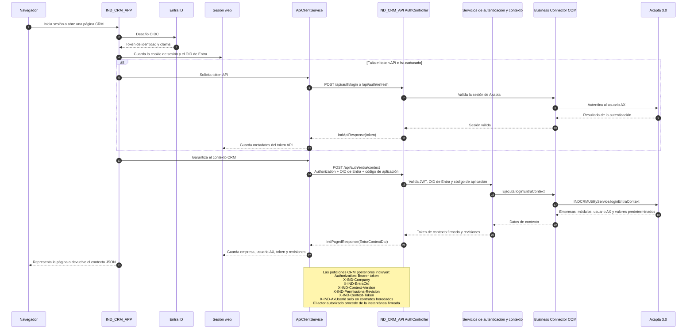

# Secuencia de autenticación y contexto

El flujo combina el inicio de sesión con Entra para la aplicación web, un JWT
para `IND_CRM_API` y un token de contexto CRM que delimita empresa y módulos.

## Contratos observados

- `POST /api/auth/login` devuelve un token tras validar las credenciales en
  Axapta.
- `POST /api/auth/refresh` renueva el JWT de la API.
- `POST /api/auth/entra/context` devuelve `IndPagedResponse<EntraContextDto>`
  con metadatos del contexto, empresas, módulos, empresa y moneda
  predeterminadas, y usuario AX.

`X-IND-AxUserId` mantiene compatibilidad con contratos heredados, pero no
demuestra la identidad del solicitante. Los endpoints migrados obtienen el
actor autorizado de la instantánea firmada, como explica
[Autenticación y contexto de empresa](../../../security/authentication-and-company-context.md).

## Límite vigente

La ruta exacta que recupera el JWT de la API después de un inicio basado solo
en Entra depende de la sesión y de la configuración del entorno. No está
confirmada para todos los perfiles de despliegue y requiere una comprobación en
el entorno de ejecución correspondiente.
