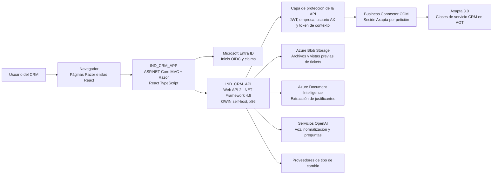

# Contexto del sistema

Este diagrama muestra los sistemas principales y las dependencias externas de
los flujos CRM. La API protege el acceso a Axapta y normaliza las respuestas
que recibe la aplicación web.

## Responsabilidades

`IND_CRM_APP` gestiona la experiencia de usuario, las vistas Razor, las islas
React, la sesión, la protección CSRF, los endpoints proxy MVC y las llamadas a
la API mediante `ICrmApiClient` y `ApiClientService`.

`IND_CRM_API` gestiona los contratos HTTP, la validación JWT y del contexto
CRM, los envoltorios de respuesta, el diagnóstico, la coordinación de servicios
externos y la única ruta de integración del servidor con Axapta.

Axapta 3.0 sigue siendo el sistema de registro para actividades, visitas,
hojas de gastos, tickets, usuarios, empresas, monedas y proyectos. El código
revisado accede a Axapta solo mediante Business Connector COM.

Los servicios externos aportan identidad, almacenamiento de archivos, OCR de
justificantes, IA de voz o texto y tipos de cambio. El orden exacto de
alternativas entre proveedores de cambio no está confirmado y requiere una
comprobación contra la configuración y el entorno de ejecución correspondiente.

## Alcance

La documentación cubre `IND_CRM_APP`, `IND_CRM_API`, Axapta 3.0 y los
servicios externos utilizados por los módulos CRM.
