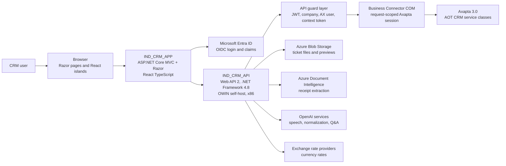

# System context

This diagram shows the main runtime systems and external dependencies for
the CRM flows. The CRM API is the boundary that protects Axapta access and
normalizes responses for the web application.

## Responsibilities

`IND_CRM_APP` owns the user experience, Razor views, React islands, session
state, CSRF handling, MVC proxy endpoints, and calls to the CRM API through
`ICrmApiClient` and `ApiClientService`.

`IND_CRM_API` owns HTTP contracts, JWT validation, CRM context validation,
standard response envelopes, diagnostics, external service orchestration, and
the only server-side integration path to Axapta.

Axapta 3.0 remains the system of record for CRM entities such as activities,
visits, expense sheets, tickets, users, companies, currencies, and projects.
The reviewed code invokes Axapta by Business Connector COM only.

External services are used for identity, blob files, receipt OCR, speech or
text AI flows, and exchange rates. Exact provider fallback behavior for
exchange rates is pendiente de validar.

## Repository note

This documentation belongs to the CRM integration surface. It covers
`IND_CRM_APP`, `IND_CRM_API`, Axapta 3.0, and the external services used by
CRM modules.
