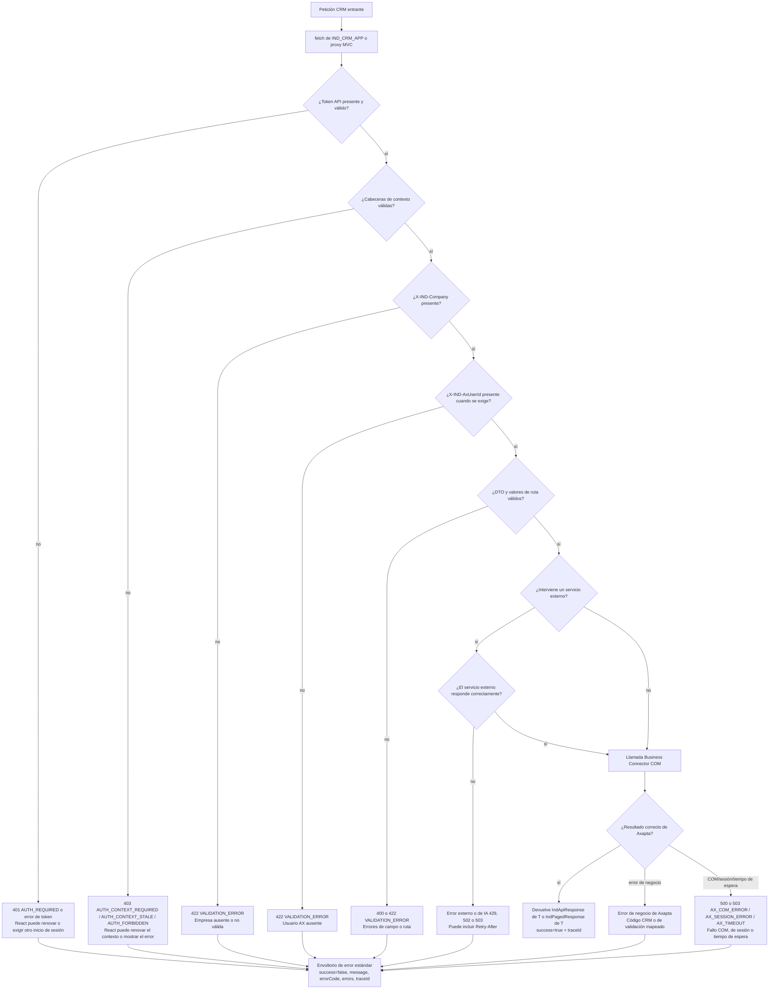

# Tratamiento de errores

Siempre que es posible, la API normaliza los fallos de validación,
autorización, Axapta, COM, tiempos de espera y servicios externos en envoltorios de
respuesta estándar.

## Comportamiento observado

- La autenticación ausente o no válida devuelve un error de autenticación.
- La ausencia de empresa o usuario AX se trata como fallo de validación.
- Un contexto CRM ausente, caducado, obsoleto o prohibido devuelve un error
  específico de contexto.
- Los fallos COM o de sesión se asignan a códigos de error de Axapta.
- Los límites de uso conocidos de IA pueden devolver HTTP 429 y `Retry-After`.
- Los tiempos de espera agotados o las caídas externas se asignan a errores de servicio externo.

## Comportamiento del cliente

El servicio API de React trata la caducidad de sesión y las respuestas que
exigen autenticación o contexto. Según el código recibido, puede renovar el
contexto o redirigir al inicio de sesión.

El comportamiento visible exacto de cada pantalla Razor antigua no está
confirmado; debe verificarse en la pantalla y el flujo concretos antes de
documentarlo como uniforme.
