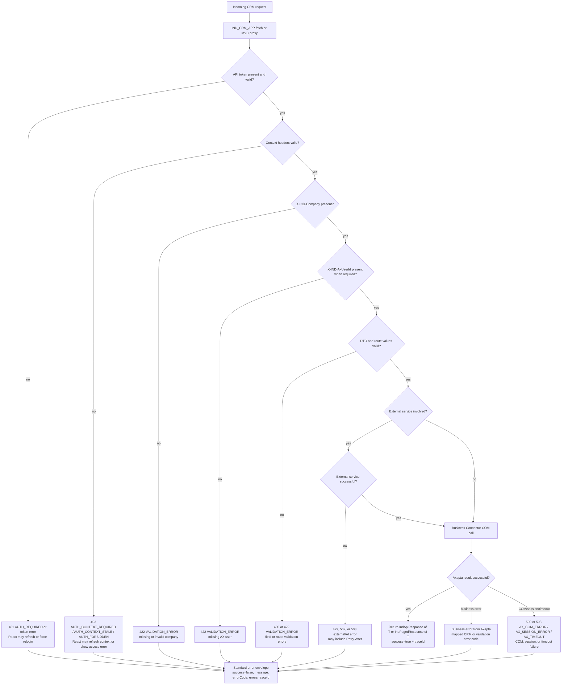

# Error handling

The API normalizes validation, authorization, Axapta, COM, timeout, and
external-service failures into standard response envelopes whenever possible.

## Observed behavior

- Missing or invalid authentication returns an auth error envelope.
- Missing company or AX user headers are treated as validation failures.
- Missing, expired, stale, or forbidden CRM context returns context-specific
  auth errors.
- Axapta COM/session failures are mapped to Axapta-specific error codes.
- Known AI rate-limit errors can return HTTP 429 and `Retry-After`.
- External-service timeouts or outages are mapped to external-service errors.

## Client behavior

The React API service handles session expiration, auth-required responses,
context-required responses, and stale-context responses. It can trigger
context refresh or force a login redirect depending on the error code.

Exact user-facing behavior for every older Razor-only screen is pendiente de
validar.
