# Flujo de creacion y edicion de una linea de hoja de gastos

Este diagrama recorre la fuente versionada actual desde la pantalla de linea
del CRM hasta los metodos de tabla de Axapta usados al crear o editar una linea
manual de gastos. Tambien muestra que campos calcula el navegador y que
valores se recalculan de forma definitiva antes de que Axapta persista la
linea.

```mermaid
flowchart TD
  Start([Abrir el detalle de una linea de hoja de gastos]) --> Entry["GastosController.ExpenseSheetLineDetail<br/>ExpenseSheetLineDetail.cshtml"]
  Entry --> React["ExpenseSheetLineDetailPage<br/>useExpenseSheetLineDetailState"]
  React --> Mode{Crear o editar?}

  Mode -->|Crear| Defaults["Preparar borrador de alta<br/>fecha=hoy; Qty=1; reembolsable=Si<br/>proyecto de cabecera; primero divisa de empresa<br/>alternativa: divisa de cabecera; ExchRate=100"]
  Mode -->|Editar| Load["Cargar la hoja y la linea persistidas"]
  Load --> Lock{Edicion bloqueada?}
  Lock -->|Politica de la hoja o Voucher| ReadOnly["Mantener la linea en modo consulta"]
  Lock -->|FileId existente| TicketEditor["Mantener la linea en modo consulta<br/>la accion Editar abre el ticket vinculado"]
  Lock -->|No| Form["ExpenseSheetLineForm<br/>borrador editable"]
  Defaults --> Form

  subgraph UiRules["IND_CRM_APP - comportamiento de campos antes de guardar"]
    Form --> Changed{Campo modificado}
    Changed -->|Tipo o fecha| IsKm{El tipo es Km?}
    IsKm -->|Si| KmPrice["GET fuel-price-km<br/>reemplazar Price y dejarlo en modo consulta"]
    IsKm -->|No| DraftReady["Borrador listo para validar"]
    KmPrice --> DraftReady

    Changed -->|Qty o Price| AmountCalc["Amount = Qty x Price<br/>recalcular AmountMST"]
    Changed -->|Amount| PriceCalc["Price = Amount / Qty<br/>recalcular AmountMST"]
    AmountCalc --> Preserve["Conservar un AmountMST explicito<br/>en la misma divisa cuando corresponda"]
    PriceCalc --> Preserve
    Preserve --> DraftReady

    Changed -->|Divisa| SameCurrency{Misma divisa de empresa/local?}
    Changed -->|Fecha con divisa extranjera| OfficialRate
    SameCurrency -->|Si| LocalCalc["ExchRate = 100<br/>AmountMST = Amount"]
    SameCurrency -->|No| OfficialRate["GET tipo de cambio oficial<br/>AmountMST = Amount x 100 / ExchRate"]
    LocalCalc --> DraftReady
    OfficialRate --> DraftReady

    Changed -->|Confirmar ExchRate| RateCalc["AmountMST = Amount x 100 / ExchRate"]
    Changed -->|AmountMST| AmountMstEdit{Misma divisa de empresa/local?}
    AmountMstEdit -->|Si| Keep100["Mantener ExchRate = 100"]
    AmountMstEdit -->|No| InverseRate["ExchRate = Amount x 100 / AmountMST"]
    RateCalc --> DraftReady
    Keep100 --> DraftReady
    InverseRate --> DraftReady

    Changed -->|Reembolsable| Preview["Persistir la enumeracion y actualizar la vista previa<br/>Si: AmountMST; No: 0"]
    Changed -->|Descripcion, internacional, proyecto| Direct["Actualizar el borrador sin recalcular importes"]
    Preview --> DraftReady
    Direct --> DraftReady
  end

  DraftReady --> UiValidation["useExpenseSheetLineTypeValidation<br/>useExpenseSheetLineDetailMutations.handleUpdate"]
  UiValidation --> UiValid{Descripcion, fecha, tipo,<br/>Qty y Price validos?<br/>Conversion a divisa de empresa resuelta?}
  UiValid -->|No| UiError["Mostrar mensaje de validacion<br/>no se envia ninguna solicitud"]
  UiValid -->|Si| Payload["commonLinePayload<br/>envia Qty, Price, divisa, AmountMST,<br/>ExchRate, reembolsable y proyecto<br/>omite Amount, ReimbursableAmount y FileId"]
  Payload --> SaveMode{Crear o editar?}

  subgraph AppWrite["IND_CRM_APP - intermediario de escritura"]
    SaveMode -->|Crear| AppCreate["expenseApi.createExpenseSheet<br/>POST /api/crm/expensesheets; mode=2<br/>GastosController.ApiExpenseSheetsCreate<br/>ValidateExpenseSheetMutationAsync<br/>ApiClientService.CreateExpenseSheetAsync"]
    SaveMode -->|Editar| AppUpdate["expenseApi.updateExpenseSheetLine<br/>PUT /api/crm/expensesheets/{sheet}/lines/{line}<br/>GastosController.ApiExpenseSheetLineUpdate<br/>ValidateExpenseSheetMutationAsync<br/>ApiClientService.UpdateExpenseSheetLineAsync"]
  end

  subgraph ApiWrite["IND_CRM_API - controlador y frontera COM"]
    AppCreate --> BeginCreate["IND_AxSessionScopeHandler.SendAsync<br/>BeginRequestScope"]
    AppUpdate --> BeginUpdate["IND_AxSessionScopeHandler.SendAsync<br/>BeginRequestScope"]
    BeginCreate --> ApiCreate["CrmExpenseSheetsController.CreateExpenseSheet<br/>Authorization; X-IND-Company; X-IND-AxUserId<br/>X-IND-EntraOid; X-IND-Context-Version<br/>X-IND-Permissions-Revision; X-IND-Context-Token<br/>validar DTO"]
    BeginUpdate --> ApiUpdate["CrmExpenseSheetsController.UpdateExpenseSheetLine<br/>Authorization; X-IND-Company; X-IND-AxUserId<br/>X-IND-EntraOid; X-IND-Context-Version<br/>X-IND-Permissions-Revision; X-IND-Context-Token<br/>validar DTO"]
    ApiCreate --> ApiCreateValid{Controles de API y DTO validos?}
    ApiUpdate --> ApiUpdateValid{Controles de API y DTO validos?}
    ApiCreateValid -->|No| EarlyFailure
    ApiUpdateValid -->|No| EarlyFailure
    ApiCreateValid -->|Si| ComCreate["AxaptaSessionManager.GetAxInstanceForUser<br/>AxaptaComSession.CreateContainer(s)<br/>construir contenedores AX raiz/cabecera/linea/opciones<br/>CallStaticClassMethod createExpenseSheet"]
    ApiUpdateValid -->|Si| ComUpdate["AxaptaSessionManager.GetAxInstanceForUser<br/>AxaptaComSession.CreateContainer<br/>construir contenedor AX plano<br/>CallStaticClassMethod updateExpenseSheetLine"]
    ComCreate -->|Error de sesion, COM o resultado ilegible| EarlyFailure["El controlador devuelve el error de API/sesion<br/>HTTP 4xx/5xx + TraceId<br/>finally del manejador: EndRequestScope<br/>mostrar error de API"]
    ComUpdate -->|Error de sesion, COM o resultado ilegible| EarlyFailure
  end

  subgraph AxService["Fuente versionada del servicio AX - INDCRMExpenseSheetService.xpo"]
    ComCreate --> CreateXpo["createExpenseSheet mode 2<br/>bloquear cabecera existente; validar propietario y linea<br/>valores por defecto de initValue / cabecera / usuario / tipo<br/>sobrescribir Qty y Price; CalcAmount<br/>despues aplicar divisa/tasa/AmountMST finales<br/>normalizar; aplicar reembolso/proyecto"]
    ComUpdate --> UpdateXpo["updateExpenseSheetLine<br/>bloquear cabecera y linea; rechazar transicion de FileId<br/>aplicar Qty y Price; CalcAmount<br/>despues aplicar divisa/tasa/AmountMST finales<br/>normalizar; aplicar reembolso/proyecto"]
    CreateXpo --> CreateValid{Se supera la validacion de<br/>validateExpenseSheetLineForApi?}
    UpdateXpo --> UpdateValid{Se supera la validacion de<br/>validateExpenseSheetLineForApi?}
  end

  CreateValid -->|No| AxError["Revertir y devolver error de validacion AX"]
  UpdateValid -->|No| AxError
  CreateValid -->|Si| Insert["CRMHojaGastosLine.insert<br/>normalizeCurrencyAmounts<br/>recalculateReimbursableAmount<br/>validar divisa; persistir; asignar proyecto"]
  UpdateValid -->|Si| Update["CRMHojaGastosLine.update<br/>recalcular Amount si cambian Qty/Price<br/>normalizar divisa y reembolso; persistir<br/>asignar proyecto y actualizar coste de proyecto"]
  Insert --> TicketCheck{FileId presente y sincronizacion permitida?}
  Update --> TicketCheck
  TicketCheck -->|Si| TicketSync["CRMHojaGastosLine.syncLinkedTicket<br/>copiar campos monetarios al ticket<br/>exactamente una linea que no sea Adjustment: copiar Qty/Price<br/>en otro caso: sincronizar linea Adjustment"]
  TicketCheck -->|No| HeaderSync["CRMHojaGastosLine.syncHojaGastosTable<br/>marcar proyecto como varios cuando proceda<br/>recalcular el estado de reembolso de la cabecera"]
  TicketSync --> HeaderSync
  HeaderSync --> Commit["INDCRMExpenseSheetService<br/>actualizar estado del ticket cuando corresponda<br/>ttscommit"]
  Commit --> Success["El controlador devuelve IndApiResponse + TraceId<br/>HTTP 201 al crear o HTTP 200 al editar"]
  AxError --> Failure["El controlador devuelve un IndApiResponse de error con TraceId<br/>HTTP 4xx/5xx"]
  Success --> ScopeEnd["finally de IND_AxSessionScopeHandler<br/>EndRequestScope: liberar objetos COM si existen<br/>cerrar sesion y liberar el bloqueo global si se adquirio"]
  Failure --> ScopeEnd
  ScopeEnd --> Envelope{Success=true en la respuesta?}
  Envelope -->|No| ShowError([Mostrar error de guardado])
  Envelope -->|Si| FinishMode{Crear o editar?}
  FinishMode -->|Crear| DoneCreate([Volver al detalle de la hoja de gastos])
  FinishMode -->|Editar| DoneEdit([Recargar el detalle de la linea])
```

## Comportamiento de los campos en la pantalla CRM

| Campo modificado | Comportamiento inmediato en el navegador |
| --- | --- |
| Linea nueva | Usa la fecha de hoy, cantidad `1`, reembolsable `Si`, el proyecto de cabecera y la divisa predeterminada de la empresa, con la divisa de cabecera como alternativa. |
| Tipo o fecha con tipo `Km` | Carga el precio por kilometro correspondiente a la fecha y deja `Price` en modo consulta. |
| `Qty` o `Price` | Calcula `Amount = Qty x Price` y despues recalcula `AmountMST`, salvo cuando se conserva un `AmountMST` manual en la divisa de empresa. |
| `Amount` | Mantiene `Qty`, obtiene `Price = Amount / Qty` y despues recalcula `AmountMST`, con la misma excepcion del valor manual en divisa de empresa. |
| Divisa | La misma divisa usa la tasa `100`; una divisa extranjera solicita la tasa oficial correspondiente a la fecha. |
| Fecha | Actualiza la tasa oficial solo cuando la divisa actual de la linea es extranjera. Tambien puede actualizar el precio por kilometro. |
| `ExchRate` | Al confirmar, calcula el importe en divisa de empresa como `AmountMST = Amount x 100 / ExchRate`. |
| `AmountMST` | Edita el importe bruto en divisa de empresa y lo marca como manual. En divisa extranjera obtiene `ExchRate = Amount x 100 / AmountMST`; en la misma divisa mantiene la tasa `100`. |
| Reembolsable | Persiste la enumeracion y cambia la vista previa: `Si` muestra `AmountMST`; `No` muestra `0`. |
| Proyecto | Selecciona un proyecto opcional para la linea y no recalcula los campos monetarios. |

`AmountMST` es el importe bruto expresado en la divisa de empresa. Es distinto
de `ReimbursableAmount`, que se obtiene a partir de la enumeracion de
reembolso.

La carga de escritura contiene los valores fuente editables, pero omite de
forma deliberada `Amount` y `ReimbursableAmount`. Axapta los obtiene o
normaliza antes de persistir:

- `CRMHojaGastosLine.CalcAmount()` redondea `Qty x Price` con la divisa que
  contiene el registro de tabla en memoria cuando se ejecuta el metodo.
- `normalizeCurrencyAmounts()` resuelve el `AmountMST` en divisa de empresa
  o la tasa de cambio inversa segun el valor monetario suministrado.
- `recalculateReimbursableAmount()` almacena `AmountMST` solo cuando
  `ReimbursableExpense == Yes`; en otro caso almacena `0`.

## Mapa de clases y XPO

| Capa | Implementacion actual |
| --- | --- |
| Pantalla CRM | `ExpenseSheetLineDetailPage`, `useExpenseSheetLineDetailState`, `ExpenseSheetLineForm`, `useExpenseSheetLineTypeValidation`, `useExpenseSheetLineDetailMutations` |
| Intermediario CRM | `expenseApi`, `GastosController`, `ValidateExpenseSheetMutationAsync`, `ApiClientService` |
| API | `CreateExpenseSheetRequest`, `UpdateExpenseSheetLineRequest`, `CrmExpenseSheetsController`, `BaseCrmController` |
| Puente AX | `IND_AxSessionScopeHandler`, `AxaptaSessionManager`, `AxaptaComSession`, Business Connector COM |
| XPO del servicio AX | `INDCRMExpenseSheetService.createExpenseSheet`, `updateExpenseSheetLine`, `validateExpenseSheetLineForApi` |
| XPO de tabla AX | `CRMHojaGastosLine.insert`, `update`, `CalcAmount`, `normalizeCurrencyAmounts`, `recalculateReimbursableAmount`, `syncLinkedTicket`, `syncHojaGastosTable` |

No existe un servicio de dominio intermedio para lineas de gasto en la API de
estos dos comandos. `CrmExpenseSheetsController` valida el DTO, construye los
contenedores AX y llama directamente al servicio XPO estatico mediante la
sesion COM.

`IND_AxSessionScopeHandler` abre el ambito de la solicitud antes de ejecutar
los controles del controlador y lo cierra desde `finally`. Por tanto, los
fallos tempranos de autorizacion o del DTO tambien pasan por
`EndRequestScope()`, aunque todavia no se haya adquirido una sesion AX ni un
objeto COM. Cuando existe una sesion, la limpieza libera los objetos
registrados en orden inverso, cierra la sesion, libera COM y deja libre el
bloqueo global.

## Edicion nativa de campos en Axapta

Las ediciones desde el formulario nativo de Axapta siguen un recorrido
separado. `CRMHojaGastosLineForm.xpo` controla que campos estan habilitados,
mientras `CRMHojaGastosLine.modifiedField()` reacciona a los cambios:

- `Qty` o `Price` llama a `CalcAmount()` y a la normalizacion de divisa.
- `Type` o `MediaDieta` llama a `InitFromGastoType()`.
- `Currency`, `ExchRate`, `Amount` y `AmountMST` ejecutan la regla de
  normalizacion o de tasa inversa correspondiente.
- `ReimbursableExpense` obtiene `ReimbursableAmount`.

El servicio CRM asigna directamente los campos de tabla del XPO; no invoca
`modifiedField()`. La proteccion comun reside en la validacion del servicio y
en los metodos de tabla `insert()` o `update()` mostrados en el diagrama.

## Observaciones sobre la fuente actual

- Una linea existente con `FileId` se muestra en modo consulta en el editor
  de linea del CRM. El XPO generico de actualizacion tambien rechaza cualquier
  transicion de `FileId`; la vinculacion y la desvinculacion usan comandos
  dedicados.
- El contrato documentado de vinculacion de tickets indica que la vinculacion
  no reemplaza los demas valores de la linea. El XPO versionado
  `linkExpenseSheetLineTicket` reemplaza actualmente `Qty`, `Price`,
  `Amount`, `Currency`, `ExchRate` y `AmountMST` con los valores del
  ticket. Esta es una discrepancia entre la fuente y el contrato.
- `syncLinkedTicket()` puede llamar a
  `syncAdjustmentLineToTotal(..., true)` para un ticket con varias lineas, lo
  que puede crear o actualizar una linea `Adjustment`. Es el comportamiento
  de la fuente actual, no un diseno propuesto.
- El manejador automatico del precio de `Km` reemplaza directamente `Price`
  y no invoca el manejador normal de cambio de `AmountMST`. Por ello, un
  `AmountMST` ya informado puede quedar temporalmente desalineado en el
  borrador.
- Si falla la solicitud de la tasa de cambio oficial, la pantalla informa del
  error, pero conserva en el borrador la tasa y el `AmountMST` anteriores.
- Los metodos XPO de creacion y actualizacion llaman a `CalcAmount()` antes
  de asignar la divisa final de la carga. `insert()` no recalcula un importe
  distinto de cero y `update()` solo lo recalcula cuando cambian `Qty` o
  `Price`, o cuando el importe esta vacio. Por tanto, un alta en divisa
  extranjera o una actualizacion que solo cambia la divisa puede conservar el
  redondeo de la divisa anterior o predeterminada.
- La pantalla CRM exige `Price > 0` en ambas operaciones. La API de creacion
  y el XPO de creacion aplican la misma regla, mientras el controlador de
  actualizacion solo exige que se suministre el precio y el XPO de
  actualizacion no aplica una comprobacion positiva explicita equivalente
  antes de la validacion de tabla. Por ello, un cliente directo de la API tiene
  una frontera menos estricta que esta pantalla CRM.

## Alcance de la evidencia

El recorrido se contrasto con la fuente actual de ambos repositorios:

- `IND_CRM_APP/Web/wwwroot/react/src/pages/gastos/line` y las utilidades de
  gastos relacionadas, `GastosController` y `ApiClientService`.
- `IND_CRM_API/Controllers/CRM/CrmExpenseSheetsController.cs`, los contratos
  de solicitud, las clases de sesion AX y `.codex/ENDPOINTS.md`.
- `IND_CRM_API/.codex/Axapta/INDCRMExpenseSheetService.xpo`,
  `CRMHojaGastosLine.xpo`, `CRMHojaGastosLineForm.xpo` y los XPO de tickets.

Esto demuestra unicamente el flujo del repositorio. No demuestra que los XPO
se hayan importado, compilado y sincronizado en el AOT usado por el AOS activo,
ni que el entorno de ejecucion actual ejecute exactamente esta version.
