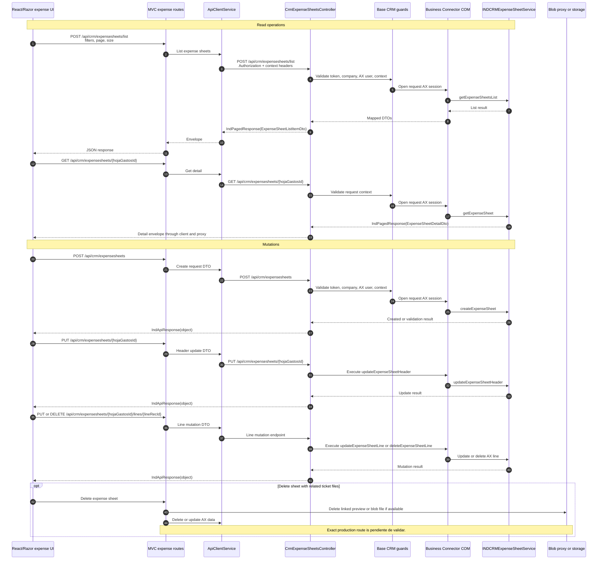

# Expense sheets sequence

Expense sheet operations pass through the same web-app proxy and API client
path. Read operations return paged data or detail envelopes. Mutations return
command envelopes and may update header or line data in Axapta.

## Related endpoints

- `POST /api/crm/expensesheets/list`
- `GET /api/crm/expensesheets/{hojaGastosId}`
- `POST /api/crm/expensesheets`
- `PUT /api/crm/expensesheets/{hojaGastosId}`
- `PUT /api/crm/expensesheets/{hojaGastosId}/lines/{lineRecId}`
- `DELETE /api/crm/expensesheets/{hojaGastosId}/lines/{lineRecId}`
- `GET /api/crm/expensesheets/currencies`
- `GET /api/crm/expensesheets/subordinates`
- `GET /api/crm/expensesheets/fuel-price-km`

The reviewed controllers also expose ticket endpoints under the same
expense-sheet route tree. Ticket-specific flow is documented separately.
