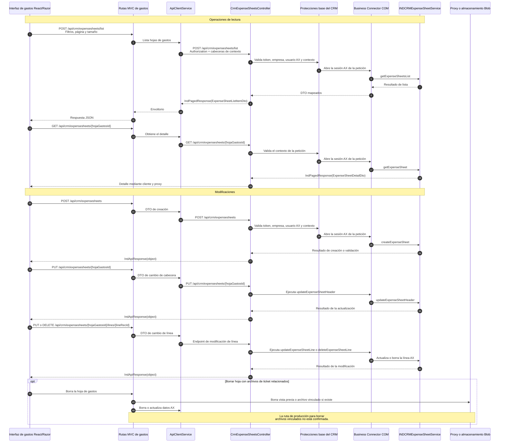

# Secuencia de hojas de gastos

Las operaciones pasan por el mismo proxy web y cliente API. Las lecturas
devuelven listas paginadas o detalles; las modificaciones pueden cambiar la
cabecera o las líneas en Axapta.

## Endpoints relacionados

- `POST /api/crm/expensesheets/list`
- `GET /api/crm/expensesheets/{hojaGastosId}`
- `POST /api/crm/expensesheets`
- `PUT /api/crm/expensesheets/{hojaGastosId}`
- `PUT /api/crm/expensesheets/{hojaGastosId}/lines/{lineRecId}`
- `DELETE /api/crm/expensesheets/{hojaGastosId}/lines/{lineRecId}`
- `GET /api/crm/expensesheets/currencies`
- `GET /api/crm/expensesheets/subordinates`
- `GET /api/crm/expensesheets/fuel-price-km`

Los controladores revisados también exponen endpoints de tickets bajo el mismo
árbol de rutas. Su flujo se documenta por separado.
