# Esquema AX de identidad, empresas y permisos para BI

Este diagrama detalla los recuadros del dominio de acceso. Los campos tienen el
nombre exacto usado por los XPO. `DATAAREAID`, `RecId` y los campos de auditoría
se muestran como columnas de sistema AX cuando son necesarios para el modelo BI.

Vista conjunta:
[esquema AX para BI](ax-bi-query-table-schema.md).

Contraparte funcional conjunta:
[mapa funcional para BI](../../user/integration/ax-bi-query-table-schema.md).

```mermaid
classDiagram
direction LR

class UserInfo {
  <<sistema AX>>
  +Id
  +Name
  +Company
}

class SysUserInfo {
  <<sistema AX>>
  +Id
  +Language
}

class INDCiasPermitidas {
  <<global>>
  +RecId
  +UserId
  +CiaId
  +INDRecIdMex
}

class INDWebUserEntraIdentity {
  <<global>>
  +RecId
  +AppCode
  +UserId
  +EntraOID
}

class INDWebApp {
  <<global>>
  +RecId
  +AppCode
  +Description
  +IsActive
}

class INDWebModule {
  <<global>>
  +RecId
  +AppCode
  +ModuleCode
  +Description
  +IsActive
}

class INDWebModuleAccessLevel {
  <<global>>
  +RecId
  +RefRecIdCiaPermitida
  +AppCode
  +ModuleCode
  +AccessRights
  +DataVisibilityMode
  +MutationPolicy
  +HierarchyDepth
  +CreatedDate
  +CreatedBy
  +ModifiedDate
  +ModifiedBy
}

class INDModuleDataVisibilityTarget {
  <<global>>
  +RecId
  +INDWebModuleAccessLevel
  +TargetPersonAlias
  +TargetAction
  +TargetScope
  +ValidFrom
  +ValidTo
  +ReasonText
}

class INDPersonaTable {
  <<por empresa>>
  +DATAAREAID
  +RecId
  +Alias
  +Name
  +UserId
  +RefRecIdCRM
  +Email
  +Blocked
  +AllowSelfManagement
}

class INDModuleDataVisibilityHierarchyLine {
  <<por empresa>>
  +DATAAREAID
  +RecId
  +ParentPersonAlias
  +ChildPersonAlias
  +ValidFrom
  +ValidTo
  +ReasonText
}

class CRMUsuarioTable {
  <<por empresa, referencia>>
  +DATAAREAID
  +RecId
  +UserId
  +AxaptaUserId
}

note for UserInfo "Nombre y empresa predeterminada del usuario AX. La estructura completa no está confirmada en AOT."
note for SysUserInfo "Identidad e idioma AX. Es la tabla nombrada por las relaciones XPO."
note for INDCiasPermitidas "Empresa autorizada por usuario. Clave lógica UserId + CiaId."
note for INDWebUserEntraIdentity "Entra OID asociado al usuario AX por aplicación. Dato sensible."
note for INDWebApp "Catálogo de aplicaciones. AppCode es la clave lógica; su unicidad no está confirmada en AOT."
note for INDWebModule "Catálogo de módulos. Clave lógica AppCode + ModuleCode."
note for INDWebModuleAccessLevel "Permiso almacenado por empresa, aplicación y módulo."
note for INDModuleDataVisibilityTarget "Excepción manual de visibilidad. La empresa se hereda del permiso."
note for INDPersonaTable "Puente por empresa entre alias, usuario AX y usuario CRM. UserId admite duplicados."
note for INDModuleDataVisibilityHierarchyLine "Jerarquía de aliases por empresa y período de vigencia."
note for CRMUsuarioTable "Referencia al usuario funcional CRM dentro de la empresa."

UserInfo ..> SysUserInfo : mismo principal AX / correspondencia física no confirmada
SysUserInfo "1" --> "0..*" INDCiasPermitidas : Id = UserId
SysUserInfo "1" --> "0..*" INDWebUserEntraIdentity : Id = UserId
INDWebApp --> INDWebUserEntraIdentity : AppCode / clave lógica
INDWebApp --> INDWebModule : AppCode / clave lógica
INDCiasPermitidas "1" --> "0..*" INDWebModuleAccessLevel : RecId = RefRecIdCiaPermitida
INDWebApp --> INDWebModuleAccessLevel : AppCode / clave lógica
INDWebModule "1" --> "0..*" INDWebModuleAccessLevel : AppCode + ModuleCode
INDWebModuleAccessLevel "1" --> "0..*" INDModuleDataVisibilityTarget : RecId

INDCiasPermitidas "0..*" --> "0..*" INDPersonaTable : UserId / CiaId = DATAAREAID
INDWebUserEntraIdentity "0..*" --> "0..*" INDPersonaTable : UserId / contexto de empresa
SysUserInfo ..> INDPersonaTable : Id = UserId / DATAAREAID / resolución X++
INDModuleDataVisibilityTarget "0..*" --> "1" INDPersonaTable : TargetPersonAlias = Alias / empresa via permiso
INDModuleDataVisibilityHierarchyLine "0..*" --> "1" INDPersonaTable : ParentPersonAlias = Alias
INDModuleDataVisibilityHierarchyLine "0..*" --> "1" INDPersonaTable : ChildPersonAlias = Alias
CRMUsuarioTable "1" --> "0..*" INDPersonaTable : RecId = RefRecIdCRM + DATAAREAID
```

## Claves y alcance

| Tabla | Alcance | Grano o clave lógica |
| --- | --- | --- |
| `INDCiasPermitidas` | Global | `UserId + CiaId` |
| `INDWebUserEntraIdentity` | Global | `UserId + AppCode + EntraOID` |
| `INDWebApp` | Global | `AppCode`; su unicidad no está confirmada en el AOT activo |
| `INDWebModule` | Global | `AppCode + ModuleCode` |
| `INDWebModuleAccessLevel` | Global | `RefRecIdCiaPermitida + ModuleCode + AppCode` |
| `INDModuleDataVisibilityTarget` | Global | `INDWebModuleAccessLevel + TargetPersonAlias + TargetAction + TargetScope + ValidFrom + ValidTo` |
| `INDPersonaTable` | Por empresa | `DATAAREAID + RecId`; `Alias` es único dentro de la empresa |
| `INDModuleDataVisibilityHierarchyLine` | Por empresa | `DATAAREAID + ParentPersonAlias + ChildPersonAlias + vigencia` |

## Precauciones para BI

- `INDWebUserEntraIdentity` no garantiza que `AppCode + EntraOID` sea único sin
  `UserId`. Tampoco garantiza una única identidad por usuario y aplicación.
- `INDPersonaTable.UserId` admite duplicados. El enlace entre usuario AX,
  persona y usuario CRM no debe modelarse como uno a uno sin controles de
  calidad.
- Un target global obtiene su empresa mediante
  `INDModuleDataVisibilityTarget -> INDWebModuleAccessLevel ->
  INDCiasPermitidas.CiaId`. Unir un target con `INDPersonaTable.Alias` sin esa
  empresa puede mezclar personas de compañías diferentes.
- `INDWebModuleAccessLevel` contiene configuración almacenada. El acceso
  efectivo requiere `AccessRights != 0`, aplicación y módulo activos,
  normalización de identidades, jerarquía, targets y la selección restrictiva
  aplicada por `INDControlDataVisibilityResolver`.
- En `INDModuleDataVisibilityHierarchyLine`, los XPO asignan a `ValidTo` el EDT
  `FromDate` y a `ValidFrom` el EDT `ToDate`. Los nombres mostrados son los
  correctos, pero el intercambio de EDT debe tratarse como una anomalía de
  origen.
- `EntraOID` y `Email` son datos sensibles y no deberían exponerse en el modelo
  semántico general.

`UserInfo` y `SysUserInfo` no tienen un XPO completo en el repositorio. Los
campos mostrados están confirmados por su uso X++, pero la estructura física
completa no está demostrada y requiere contraste con el AOT activo.
