# Esquema AX de identidad, empresas y permisos para BI

Este diagrama detalla los recuadros del dominio de acceso. Los campos tienen el
nombre exacto usado por los XPO. `DATAAREAID`, `RecId` y los campos de auditoria
se muestran como columnas de sistema AX cuando son necesarios para el modelo BI.

Vista conjunta:
[esquema AX para BI](ax-bi-query-table-schema.md).

Contraparte funcional conjunta:
[mapa funcional para BI](../../user/integration/ax-bi-query-table-schema.md).

```mermaid
classDiagram
direction LR

class UserInfo {
  <<sistema AX>>
  +Id
  +Name
  +Company
}

class SysUserInfo {
  <<sistema AX>>
  +Id
  +Language
}

class INDCiasPermitidas {
  <<global>>
  +RecId
  +UserId
  +CiaId
  +INDRecIdMex
}

class INDWebUserEntraIdentity {
  <<global>>
  +RecId
  +AppCode
  +UserId
  +EntraOID
}

class INDWebApp {
  <<global>>
  +RecId
  +AppCode
  +Description
  +IsActive
}

class INDWebModule {
  <<global>>
  +RecId
  +AppCode
  +ModuleCode
  +Description
  +IsActive
}

class INDWebModuleAccessLevel {
  <<global>>
  +RecId
  +RefRecIdCiaPermitida
  +AppCode
  +ModuleCode
  +AccessRights
  +DataVisibilityMode
  +MutationPolicy
  +HierarchyDepth
  +CreatedDate
  +CreatedBy
  +ModifiedDate
  +ModifiedBy
}

class INDModuleDataVisibilityTarget {
  <<global>>
  +RecId
  +INDWebModuleAccessLevel
  +TargetPersonAlias
  +TargetAction
  +TargetScope
  +ValidFrom
  +ValidTo
  +ReasonText
}

class INDPersonaTable {
  <<por empresa>>
  +DATAAREAID
  +RecId
  +Alias
  +Name
  +UserId
  +RefRecIdCRM
  +Email
  +Blocked
  +AllowSelfManagement
}

class INDModuleDataVisibilityHierarchyLine {
  <<por empresa>>
  +DATAAREAID
  +RecId
  +ParentPersonAlias
  +ChildPersonAlias
  +ValidFrom
  +ValidTo
  +ReasonText
}

class CRMUsuarioTable {
  <<por empresa, referencia>>
  +DATAAREAID
  +RecId
  +UserId
  +AxaptaUserId
}

note for UserInfo "Nombre y empresa predeterminada del usuario AX. Estructura completa pendiente de AOT."
note for SysUserInfo "Identidad e idioma AX. Es la tabla nombrada por las relaciones XPO."
note for INDCiasPermitidas "Empresa autorizada por usuario. Clave logica UserId + CiaId."
note for INDWebUserEntraIdentity "Entra OID asociado al usuario AX por aplicacion. Dato sensible."
note for INDWebApp "Catalogo de aplicaciones. AppCode es clave logica pendiente de validar en AOT."
note for INDWebModule "Catalogo de modulos. Clave logica AppCode + ModuleCode."
note for INDWebModuleAccessLevel "Permiso almacenado por empresa, aplicacion y modulo."
note for INDModuleDataVisibilityTarget "Excepcion manual de visibilidad. La empresa se hereda del permiso."
note for INDPersonaTable "Puente por empresa entre alias, usuario AX y usuario CRM. UserId admite duplicados."
note for INDModuleDataVisibilityHierarchyLine "Jerarquia de aliases por empresa y periodo de vigencia."
note for CRMUsuarioTable "Referencia al usuario funcional CRM dentro de la empresa."

UserInfo ..> SysUserInfo : mismo principal AX / correspondencia fisica pendiente
SysUserInfo "1" --> "0..*" INDCiasPermitidas : Id = UserId
SysUserInfo "1" --> "0..*" INDWebUserEntraIdentity : Id = UserId
INDWebApp --> INDWebUserEntraIdentity : AppCode / clave logica
INDWebApp --> INDWebModule : AppCode / clave logica
INDCiasPermitidas "1" --> "0..*" INDWebModuleAccessLevel : RecId = RefRecIdCiaPermitida
INDWebApp --> INDWebModuleAccessLevel : AppCode / clave logica
INDWebModule "1" --> "0..*" INDWebModuleAccessLevel : AppCode + ModuleCode
INDWebModuleAccessLevel "1" --> "0..*" INDModuleDataVisibilityTarget : RecId

INDCiasPermitidas "0..*" --> "0..*" INDPersonaTable : UserId / CiaId = DATAAREAID
INDWebUserEntraIdentity "0..*" --> "0..*" INDPersonaTable : UserId / contexto de empresa
SysUserInfo ..> INDPersonaTable : Id = UserId / DATAAREAID / resolucion X++
INDModuleDataVisibilityTarget "0..*" --> "1" INDPersonaTable : TargetPersonAlias = Alias / empresa via permiso
INDModuleDataVisibilityHierarchyLine "0..*" --> "1" INDPersonaTable : ParentPersonAlias = Alias
INDModuleDataVisibilityHierarchyLine "0..*" --> "1" INDPersonaTable : ChildPersonAlias = Alias
CRMUsuarioTable "1" --> "0..*" INDPersonaTable : RecId = RefRecIdCRM + DATAAREAID
```

## Claves y alcance

| Tabla | Alcance | Grano o clave logica |
| --- | --- | --- |
| `INDCiasPermitidas` | Global | `UserId + CiaId` |
| `INDWebUserEntraIdentity` | Global | `UserId + AppCode + EntraOID` |
| `INDWebApp` | Global | `AppCode`, pendiente de confirmar como unico en AOT vivo |
| `INDWebModule` | Global | `AppCode + ModuleCode` |
| `INDWebModuleAccessLevel` | Global | `RefRecIdCiaPermitida + ModuleCode + AppCode` |
| `INDModuleDataVisibilityTarget` | Global | `INDWebModuleAccessLevel + TargetPersonAlias + TargetAction + TargetScope + ValidFrom + ValidTo` |
| `INDPersonaTable` | Por empresa | `DATAAREAID + RecId`; `Alias` es unico dentro de empresa |
| `INDModuleDataVisibilityHierarchyLine` | Por empresa | `DATAAREAID + ParentPersonAlias + ChildPersonAlias + vigencia` |

## Precauciones para BI

- `INDWebUserEntraIdentity` no garantiza que `AppCode + EntraOID` sea unico sin
  `UserId`. Tampoco garantiza una unica identidad por usuario y aplicacion.
- `INDPersonaTable.UserId` admite duplicados. El enlace entre usuario AX,
  persona y usuario CRM no debe modelarse como uno a uno sin controles de
  calidad.
- Un target global obtiene su empresa mediante
  `INDModuleDataVisibilityTarget -> INDWebModuleAccessLevel ->
  INDCiasPermitidas.CiaId`. Unir un target con `INDPersonaTable.Alias` sin esa
  empresa puede mezclar personas de companias diferentes.
- `INDWebModuleAccessLevel` contiene configuracion almacenada. El acceso
  efectivo requiere `AccessRights != 0`, aplicacion y modulo activos,
  normalizacion de identidades, jerarquia, targets y la seleccion restrictiva
  aplicada por `INDControlDataVisibilityResolver`.
- En `INDModuleDataVisibilityHierarchyLine`, los XPO asignan a `ValidTo` el EDT
  `FromDate` y a `ValidFrom` el EDT `ToDate`. Los nombres mostrados son los
  correctos, pero el intercambio de EDT debe tratarse como anomalia de origen.
- `EntraOID` y `Email` son datos sensibles y no deberian exponerse en el modelo
  semantico general.

`UserInfo` y `SysUserInfo` no tienen XPO completo en el repositorio. Los campos
mostrados estan confirmados por su uso X++, pero su estructura fisica queda
pendiente de contrastar con el AOT.
