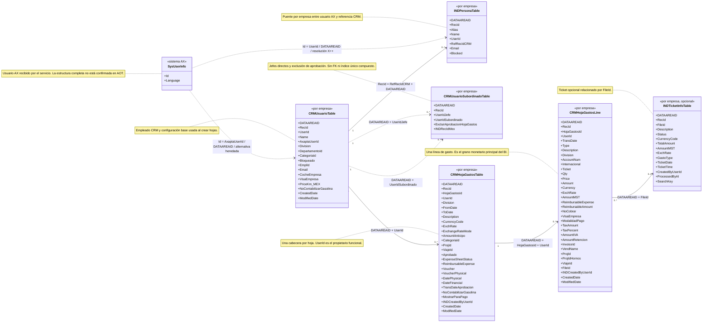

# Esquema AX de usuarios CRM y hojas de gastos para BI

Este diagrama detalla los recuadros de personas, usuarios CRM, jerarquía de
aprobación, cabeceras, líneas y tickets. Los campos mostrados son una selección
de claves, dimensiones y medidas principales con el nombre exacto usado por
los XPO. `DATAAREAID`, `RecId`, `CreatedDate` y `ModifiedDate` son columnas de
sistema AX habilitadas por las propiedades de cada tabla.

Vista conjunta:
[esquema AX para BI](ax-bi-query-table-schema.md).

Contraparte funcional conjunta:
[mapa funcional para BI](../../user/integration/ax-bi-query-table-schema.md).



## Flujo de creación confirmado

```text
AxUserId
  -> resolución de CRMUsuarioTable.UserId dentro de DATAAREAID
  -> CRMHojaGastosTable.UserId
  -> initFromUsuarioTable
  -> Division, CategoriaId y NoContabilizarGasolina
  -> CRMHojaGastosLine con el mismo propietario CRM
```

`CRMHojaGastosTable.UserId` es el propietario funcional. El campo
`INDCreatedByUserId` conserva el usuario AX que creó el registro y no debe
usarse como sustituto del propietario.

## Claves y controles de calidad

| Tabla | Grano recomendado | Control necesario |
| --- | --- | --- |
| `CRMUsuarioTable` | `DATAAREAID + UserId` | `AxaptaUserId` admite duplicados y solo es una alternativa heredada. |
| `CRMUsuarioSubordinadoTable` | `DATAAREAID + UserIdJefe + UserIdSubordinado` | El XPO no declara FK ni índice único compuesto; `validateWrite` controla duplicados y ciclos en el entorno de ejecución. |
| `CRMHojaGastosTable` | `DATAAREAID + HojaGastosId` | Validar que `UserId` exista en `CRMUsuarioTable` de la misma empresa. |
| `CRMHojaGastosLine` | `DATAAREAID + RecId` | Validar cabecera con `DATAAREAID + HojaGastosId + UserId`. |
| `INDTicketInfoTable` | `DATAAREAID + FileId` | La línea admite `FileId` repetido físicamente; revisar duplicados antes de asumir uno a uno. |

## Medidas monetarias

- `Amount` es el importe original expresado en `Currency`.
- `AmountMST` es el importe bruto en la moneda contable de la empresa. Aunque
  la etiqueta histórica mencione EUR, el BI no debe fijar EUR para todas las
  compañías.
- `ReimbursableAmount` deriva de `ReimbursableExpense` y vale cero cuando la
  línea queda excluida del reembolso.
- `VisaEmpresa` conserva una semántica heredada inversa; no debe ser el criterio
  principal para determinar el reembolso.
- Los totales exactos a pagar también aplican `NoCobrar`, anticipos y reglas de
  modalidad de pago. Una suma simple no debe etiquetarse como pago AX definitivo
  hasta reconciliarla con los métodos de total del XPO.

La fuente demuestra el esquema versionado, no la importación, compilación o
sincronización actual en el AOT activo.
