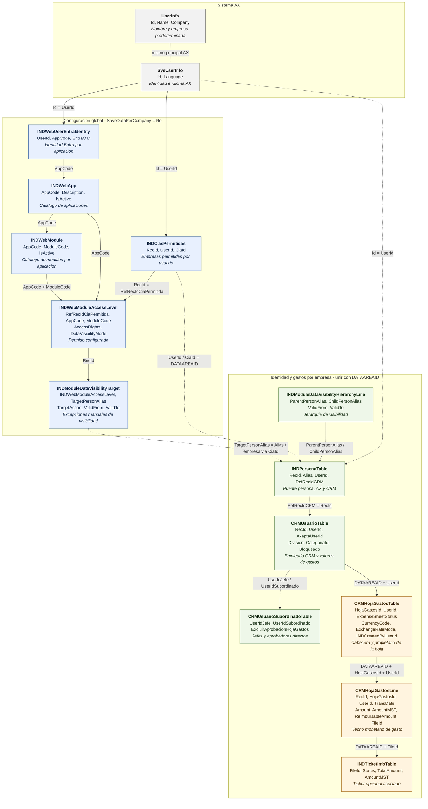

# Esquema AX de tablas para BI de consultas

Este mapa conecta las tablas AX de identidad, empresas permitidas, permisos y
hojas de gastos. Cada recuadro conserva el nombre exacto de la tabla, muestra
una seleccion de claves y medidas principales para BI y contiene una nota
breve.

Para ver mas campos y cardinalidades, use las dos laminas detalladas:

- [Identidad, empresas y permisos](ax-bi-access-table-schema.md).
- [Usuarios CRM y hojas de gastos](ax-bi-expense-table-schema.md).

Contraparte funcional:
[mapa funcional para BI](../../user/integration/ax-bi-query-table-schema.md).

## Leyenda y reglas de union

- Flecha continua: relacion declarada en XPO o relacion cabecera-linea
  confirmada.
- Flecha discontinua: union logica, resolucion X++ o fallback heredado.
- Las tablas web son globales. La empresa del permiso se obtiene mediante
  `INDWebModuleAccessLevel.RefRecIdCiaPermitida -> INDCiasPermitidas.RecId ->
  INDCiasPermitidas.CiaId`.
- `INDPersonaTable`, `CRMUsuarioTable`, subordinados, hojas, lineas, jerarquia y
  tickets son por empresa. En SQL o BI sus uniones deben incluir
  `DATAAREAID`.
- El propietario funcional es `CRMHojaGastosTable.UserId`.
  `INDCreatedByUserId` es un dato de auditoria, no el propietario.
- `CRMHojaGastosLine.AmountMST` es el importe bruto en la moneda contable de la
  empresa. `ReimbursableAmount` es el importe reembolsable derivado.

## Limites confirmados

`UserInfo` y `SysUserInfo` no tienen XPO completo en el repositorio; solo se
muestran los campos demostrados por las referencias y usos actuales. Ademas,
hay dos exportaciones divergentes de `INDWebApp`, una sin indice declarado y
otra con `AppCodeIdx` unico. El diagrama usa `AppCode` como clave logica, pero
la unicidad fisica debe validarse en el AOT o SQL vivo.

El mapa representa la fuente versionada. No demuestra que los mismos XPO esten
importados, compilados y sincronizados en el AOS activo.
