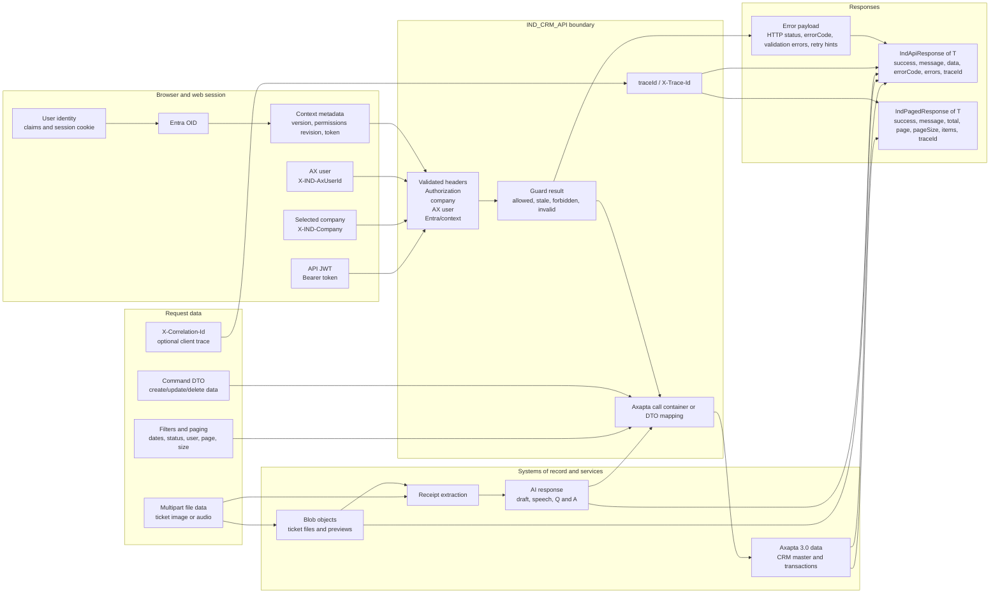

# Data flow

This diagram focuses on data items rather than runtime components. It shows
how identity, context, headers, request DTOs, envelopes, trace data, and
errors move through the CRM stack.

## Main DTO and envelope observations

The analyzed API uses `IndApiResponse<T>` for single-result commands and
`IndPagedResponse<T>` for list/detail-style CRM responses. Both include a
diagnostic `traceId` in the API implementation.

The web app has corresponding response models and TypeScript clients that
unwrap `success`, `message`, `errorCode`, `items`, `data`, paging fields, and
context errors.

Request DTO field-level contracts are intentionally not duplicated here
because they must remain inferred from source code, Swagger/OpenAPI, Postman,
or existing clients. Bodies containing sensitive or customer data are omitted.
