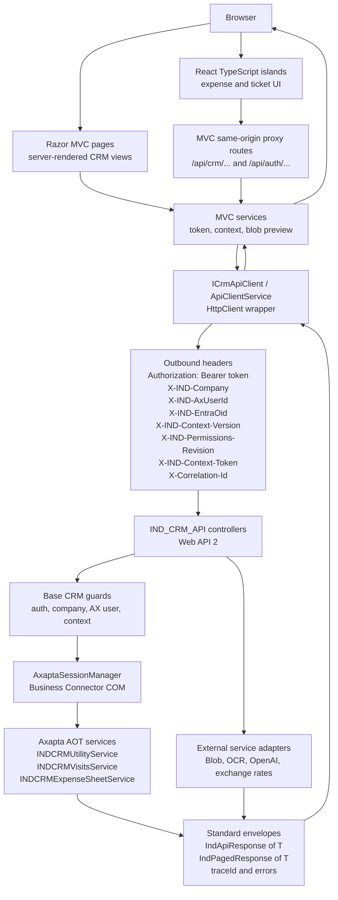

# Integration overview

The normal CRM path is browser UI to MVC/Razor services, then to the shared
API client, then to `IND_CRM_API`, and finally to Axapta through Business
Connector COM.

## Main boundaries

`IND_CRM_APP` should not call Axapta directly. It uses MVC controllers and
services to hide token refresh, context refresh, CSRF, and API envelope
handling from React components.

`IND_CRM_API` should not expose raw COM or Axapta containers to web clients.
Controllers map HTTP DTOs to Axapta calls and return standard envelopes.

Business Connector COM is an implementation detail behind
`AxaptaSessionManager`. Its x86 requirement affects hosting, deployment, and
diagnostics.

## Detected inventory

Client-side and web-app entry points:

- React services call same-origin `/api/...` routes from the browser.
- MVC/Razor controllers expose proxy routes for auth context, expense sheets,
  tickets, AI helpers, exchange rates, and blob previews.
- `ICrmApiClient` and `ApiClientService` encapsulate outbound HTTP calls to
  `IND_CRM_API`.
- Token and context services store API token, Entra OID, selected company,
  AX user, context token, context version, and permissions revision in the web
  session.

Relevant API controllers detected:

- Auth: `POST /api/auth/login`, `POST /api/auth/refresh`,
  `POST /api/auth/entra/context`.
- Accounts and contacts: `POST /api/crm/accounts/listAccounts`,
  `POST /api/crm/accounts/listContacts`.
- Activities: `POST /api/crm/activities/list`,
  `POST /api/crm/activities/create`, `GET /api/crm/activities/{recId}`,
  `PUT /api/crm/activities/{recId}`, `DELETE /api/crm/activities/{recId}`,
  `GET /api/crm/activities/by-code/{code}`.
- Visits: `POST /api/crm/visits/createVisitaAsistente`,
  `DELETE /api/crm/visits/deleteVisitaAsistente`.
- Expense sheets and tickets: documented in the dedicated sequence files.
- AI and transcription: `POST /api/ia/service/speech`,
  `POST /api/ia/service/expensefromticket`,
  `POST /api/ia/service/expensesheets/ask`.
- System and health: health checks, environment/company name, projects, and
  exchange-rate endpoints.

Axapta integration points detected:

- `INDCRMUtilityService.loginEntraContext` for user/company/module context.
- `INDCRMVisitsService` for accounts, contacts, activities, and visit
  assistants.
- `INDCRMExpenseSheetService` for expense sheets, tickets, projects, and
  ticket AI persistence.

## Relevant headers

- `Authorization: Bearer <token>` authenticates the CRM API request.
- `X-IND-Company: <companyId>` selects the company context.
- `X-IND-AxUserId: <axUserId>` selects the Axapta CRM user.
- `X-IND-EntraOid: <entraOid>` binds the request to Entra identity context.
- `X-IND-Context-Version: <version>` and
  `X-IND-Permissions-Revision: <revision>` protect against stale context.
- `X-IND-Context-Token: <contextToken>` signs the company/module snapshot.
- `X-Correlation-Id: <id>` links logs across layers when supplied.

The exact set of context headers on older MVC/Razor pages outside the expense
React flow is pendiente de validar.
