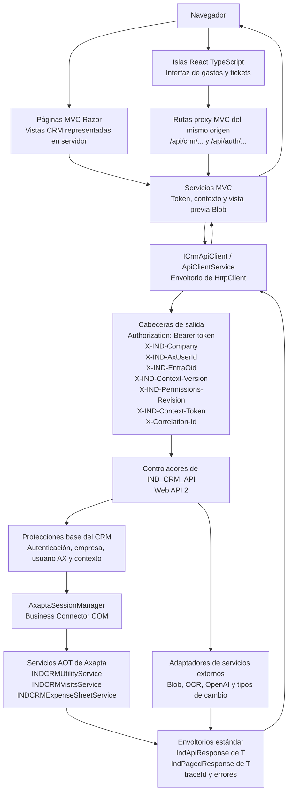

# Vista general de la integración

El recorrido normal va desde la interfaz del navegador a los servicios
MVC/Razor, continúa por el cliente API compartido hasta `IND_CRM_API` y llega
a Axapta mediante Business Connector COM.

## Límites principales

`IND_CRM_APP` no llama directamente a Axapta. Sus controladores y servicios
MVC ocultan a los componentes React la renovación de token y contexto, CSRF y
el tratamiento de los envoltorios de la API.

`IND_CRM_API` no expone COM ni contenedores de Axapta sin procesar. Los
controladores convierten DTO HTTP en llamadas a Axapta y devuelven envoltorios
estándar.

Business Connector COM queda encapsulado por `AxaptaSessionManager`. Su
requisito x86 condiciona el alojamiento, el despliegue y el diagnóstico.

## Inventario detectado

Puntos de entrada del cliente y de la aplicación web:

- Los servicios React llaman desde el navegador a rutas `/api/...` del mismo
  origen.
- Los controladores MVC/Razor ofrecen rutas proxy para contexto, gastos,
  tickets, IA, tipos de cambio y vistas previas Blob.
- `ICrmApiClient` y `ApiClientService` encapsulan las llamadas HTTP de salida a
  `IND_CRM_API`.
- Los servicios de token y contexto conservan en la sesión web el token API,
  OID de Entra, empresa elegida, usuario AX, token y versiones de contexto y
  permisos.

Controladores API relevantes:

- Autenticación: `POST /api/auth/login`, `POST /api/auth/refresh`,
  `POST /api/auth/entra/context`.
- Cuentas y contactos: `POST /api/crm/accounts/listAccounts`,
  `POST /api/crm/accounts/listContacts`.
- Actividades: `POST /api/crm/activities/list`,
  `POST /api/crm/activities/create`, `GET /api/crm/activities/{recId}`,
  `PUT /api/crm/activities/{recId}`, `DELETE /api/crm/activities/{recId}`,
  `GET /api/crm/activities/by-code/{code}`.
- Visitas: `POST /api/crm/visits/createVisitaAsistente`,
  `DELETE /api/crm/visits/deleteVisitaAsistente`.
- Hojas de gastos y tickets: se documentan en sus secuencias específicas.
- IA y transcripción: `POST /api/ia/service/speech`,
  `POST /api/ia/service/expensefromticket`,
  `POST /api/ia/service/expensesheets/ask`.
- Sistema y salud: endpoints de health, entorno o empresa, proyectos y tipos
  de cambio.

Puntos de integración con Axapta:

- `INDCRMUtilityService.loginEntraContext` para el contexto de usuario, empresa
  y módulo.
- `INDCRMVisitsService` para cuentas, contactos, actividades y asistentes de
  visita.
- `INDCRMExpenseSheetService` para hojas de gastos, tickets, proyectos y
  persistencia de IA del ticket.

## Cabeceras relevantes

- `Authorization: Bearer <token>` autentica la petición a la API CRM.
- `X-IND-Company: <companyId>` selecciona el contexto de empresa.
- `X-IND-AxUserId: <axUserId>` aporta el usuario funcional o propietario en los
  contratos que lo requieren; no sustituye al actor autorizado del contexto
  firmado.
- `X-IND-EntraOid: <entraOid>` vincula la petición con la identidad Entra.
- `X-IND-Context-Version: <version>` y
  `X-IND-Permissions-Revision: <revision>` detectan contextos obsoletos.
- `X-IND-Context-Token: <contextToken>` firma la instantánea de empresa y
  módulo.
- `X-Correlation-Id: <id>` enlaza registros entre capas cuando se proporciona.

El conjunto exacto de cabeceras enviado por las pantallas MVC/Razor antiguas,
fuera del flujo React de gastos, no está confirmado de forma uniforme y debe
verificarse en cada recorrido antes de modificar su contrato.
