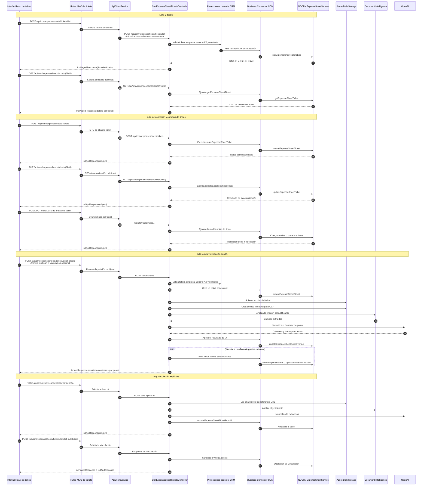

# Secuencia de tickets

Los tickets se tratan como justificantes de gastos con carga opcional de
archivo, extracción por IA, líneas y vinculación. El flujo puede escribir en
Blob, crear accesos temporales para OCR, llamar a OpenAI y modificar Axapta.

## Efectos laterales

- La carga del archivo escribe en Blob Storage.
- OCR e IA pueden crear acceso Blob temporal y peticiones externas.
- Aplicar IA modifica la cabecera o las líneas del ticket en Axapta.
- La vinculación masiva puede crear o actualizar relaciones con hojas.
- `quick-create` devuelve identificadores de traza por paso si existen.

El método exacto de Axapta usado por cada variante de vinculación no está
confirmado en este documento; debe verificarse en la implementación X++ antes
de cambiar o publicar ese contrato.

## Endpoints relacionados

- `POST /api/crm/expensesheets/tickets`
- `POST /api/crm/expensesheets/tickets/quick-create`
- `POST /api/crm/expensesheets/tickets/list`
- `POST /api/crm/expensesheets/tickets/link/list`
- `POST /api/crm/expensesheets/tickets/link/bulk`
- `GET /api/crm/expensesheets/tickets/{fileId}`
- `PUT /api/crm/expensesheets/tickets/{fileId}`
- `DELETE /api/crm/expensesheets/tickets/{fileId}`
- `POST /api/crm/expensesheets/tickets/{fileId}/ia`
- `POST /api/crm/expensesheets/tickets/{fileId}/file`
- `DELETE /api/crm/expensesheets/tickets/{fileId}/file`
- Endpoints `POST`, `PUT` y `DELETE` de líneas bajo
  `/api/crm/expensesheets/tickets/{fileId}/lines`.
- `POST /api/ia/service/speech`
- `POST /api/ia/service/expensefromticket`
- `POST /api/ia/service/expensesheets/ask`
