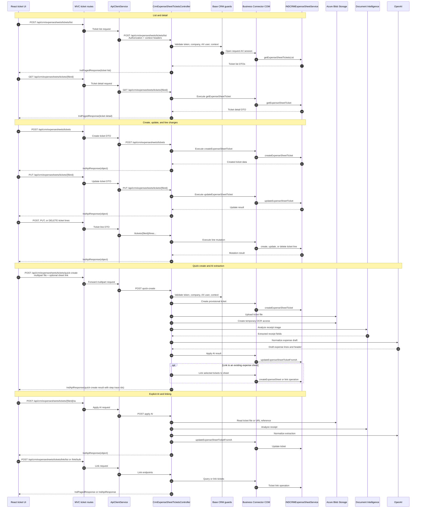

# Tickets sequence

Tickets are handled as CRM expense-sheet artifacts with optional file upload,
AI extraction, line creation, and link operations. Side effects can include
Blob writes, temporary OCR files, OpenAI calls, and Axapta mutations.

## Side effects

- Ticket file upload writes to Blob Storage.
- OCR and AI flows may create temporary blob access and external-service
  requests.
- Applying AI mutates ticket header/line data in Axapta.
- Bulk linking may create or update expense-sheet relationships in Axapta.
- `quick-create` returns step trace identifiers when available.

The exact Axapta method used for every link variant is pendiente de validar
from X++ implementation details.

## Related endpoints

- `POST /api/crm/expensesheets/tickets`
- `POST /api/crm/expensesheets/tickets/quick-create`
- `POST /api/crm/expensesheets/tickets/list`
- `POST /api/crm/expensesheets/tickets/link/list`
- `POST /api/crm/expensesheets/tickets/link/bulk`
- `GET /api/crm/expensesheets/tickets/{fileId}`
- `PUT /api/crm/expensesheets/tickets/{fileId}`
- `DELETE /api/crm/expensesheets/tickets/{fileId}`
- `POST /api/crm/expensesheets/tickets/{fileId}/ia`
- `POST /api/crm/expensesheets/tickets/{fileId}/file`
- `DELETE /api/crm/expensesheets/tickets/{fileId}/file`
- `POST`, `PUT`, and `DELETE` line endpoints under
  `/api/crm/expensesheets/tickets/{fileId}/lines`.
- `POST /api/ia/service/speech`
- `POST /api/ia/service/expensefromticket`
- `POST /api/ia/service/expensesheets/ask`
