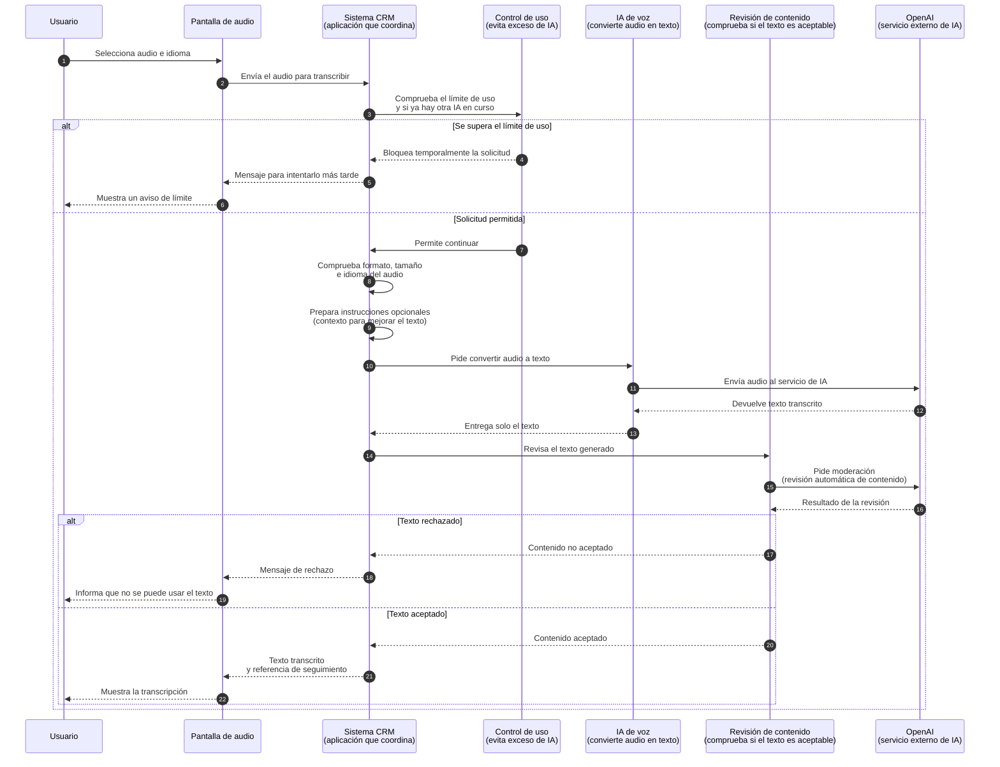

# Flujo funcional: transcripción de audio

Fuente técnica:
[ai-audio-transcription-sequence.md](../../technical/ai/ai-audio-transcription-sequence.md)

Esta versión explica las mismas decisiones y resultados con lenguaje sencillo.

## Explicación funcional

La persona envía un audio y recibe texto. El sistema comprueba primero los
límites de uso y las reglas del archivo. Después, una IA convierte el audio en
texto y otra revisión automática comprueba si puede mostrarse.
