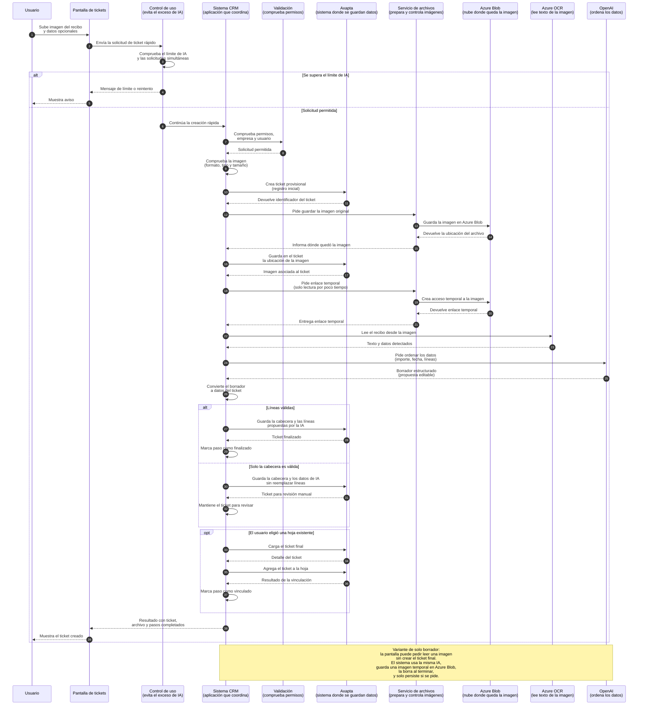

# Flujo funcional: ticket desde imagen con IA

Fuente técnica:
[ticket-image-ai-sequence.md](../../technical/ai/ticket-image-ai-sequence.md)

Esta versión conserva los pasos del flujo técnico, pero usa etiquetas sencillas
y explica entre paréntesis los términos necesarios.

## Explicación funcional

La persona sube la imagen de un justificante. El sistema crea un ticket
provisional, guarda la imagen, la lee con OCR y pide a la IA que ordene los
datos detectados en campos y líneas.

Si las líneas propuestas son válidas, finaliza el ticket. Si solo es válida la
cabecera, queda disponible para revisión manual. Si se eligió una hoja
existente, también puede vincularse a ella.
