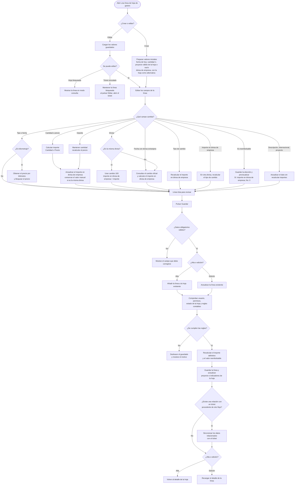

# Flujo de usuario: crear o editar una línea de hoja de gastos

Fuente técnica:
[expense-sheet-line-create-edit-flow.md](../../technical/expenses/expense-sheet-line-create-edit-flow.md)

Este diagrama explica qué ocurre al cambiar los campos de una línea manual y
al guardarla. Mantiene las mismas decisiones de negocio que el diagrama
técnico, pero evita nombres internos de clases y servicios.

## Reglas principales

- Una línea nueva comienza con fecha de hoy, cantidad `1` y la divisa
  predeterminada de la empresa; si falta, usa la de la hoja. Solo copia el
  proyecto de la hoja cuando es válido y único; si está vacío, es `VARIOS` o ya
  no admite gastos, la línea empieza sin proyecto.
- El precio de kilometraje se obtiene para la fecha elegida y no se puede
  escribir manualmente desde esta pantalla.
- Cambiar cantidad, precio o importe actualiza los otros valores relacionados.
  Si se introdujo manualmente el importe en divisa de empresa y ambas divisas
  coinciden, la pantalla conserva ese valor.
- En la misma divisa se usa el cambio `100`. En otra divisa se consulta el
  cambio oficial o se deriva del importe en divisa de empresa introducido.
- Cambiar la fecha solo refresca el tipo de cambio cuando la divisa es
  extranjera; también puede refrescar el precio de kilometraje.
- Marcar la línea como reembolsable no cambia el importe original: decide si el
  importe en divisa de empresa se incluye como reembolsable o queda en `0`.
- Al guardar, el sistema vuelve a calcular y validar los valores definitivos.
  Si una regla falla, no conserva un guardado parcial.

## Líneas vinculadas a un ticket

Una línea existente vinculada a un ticket no se edita como línea manual desde
esta pantalla. Al pulsar Editar, la aplicación conduce al editor del ticket. La
vinculación y la desvinculación son recorridos independientes de este guardado.
