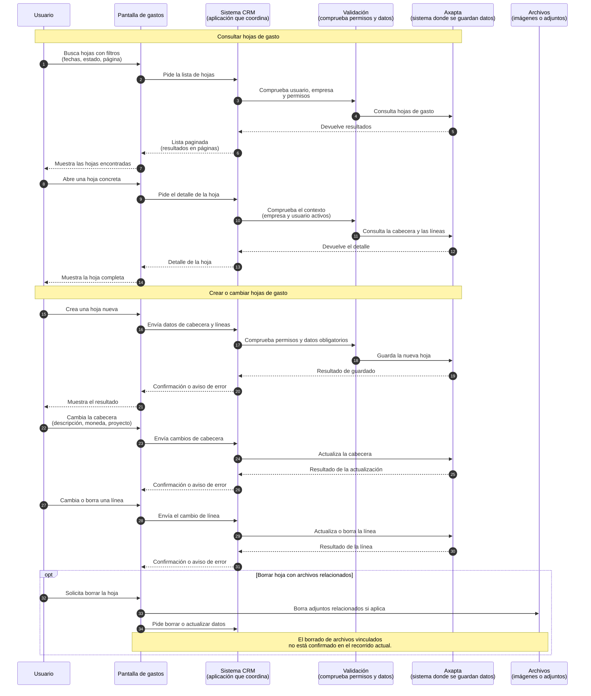

# Flujo funcional: hojas de gastos

Fuente técnica:
[expense-sheets-sequence.md](../../technical/expenses/expense-sheets-sequence.md)

Esta versión conserva el orden del flujo técnico, pero usa lenguaje de negocio
y explica entre paréntesis los términos necesarios.

## Explicación funcional

La persona puede buscar, abrir, crear y actualizar hojas de gastos. Antes de
guardar en Axapta, el sistema comprueba la empresa activa, los permisos y los
datos obligatorios.

Si la operación termina correctamente, la pantalla muestra la información
actualizada. Si falta algo o no puede guardarse, muestra un aviso explicativo.
