# Mapa funcional de datos AX para BI de consultas

Fuente técnica:
[ax-bi-query-table-schema.md](../../technical/integration/ax-bi-query-table-schema.md)

Este mapa agrupa las tablas por su finalidad de negocio. Los nombres técnicos
se mantienen para que sea posible localizarlas en AX o en una capa de datos,
pero el texto explica qué aporta cada grupo a una consulta BI.

```mermaid
flowchart LR
  Identity["<b>Identidad del usuario</b><br/>UserInfo / SysUserInfo<br/>INDWebUserEntraIdentity<br/><br/>Relaciona el acceso Entra con el usuario AX"]
  Companies["<b>Empresas permitidas</b><br/>INDCiasPermitidas<br/><br/>Indica en qué empresas puede trabajar"]
  Modules["<b>Aplicaciones y módulos</b><br/>INDWebApp / INDWebModule<br/>INDWebModuleAccessLevel<br/><br/>Define acceso y reglas de visibilidad"]
  Visibility["<b>Personas visibles</b><br/>INDPersonaTable<br/>INDModuleDataVisibilityTarget<br/>INDModuleDataVisibilityHierarchyLine<br/><br/>Resuelve identidad, jerarquía y excepciones"]
  Employee["<b>Empleado CRM por empresa</b><br/>CRMUsuarioTable<br/><br/>Aporta propietario y valores iniciales de gastos"]
  Managers["<b>Jefes y subordinados</b><br/>CRMUsuarioSubordinadoTable<br/><br/>Determina consulta y aprobación de hojas"]
  Sheet["<b>Cabecera de hoja</b><br/>CRMHojaGastosTable<br/><br/>Guarda propietario, estado, período y divisa"]
  Line["<b>Líneas de gasto</b><br/>CRMHojaGastosLine<br/><br/>Guarda fecha, tipo, importes, reembolso y proyecto"]
  Ticket["<b>Ticket opcional</b><br/>INDTicketInfoTable<br/><br/>Aporta el justificante asociado mediante FileId"]

  Identity --> Companies
  Companies --> Modules
  Identity --> Visibility
  Modules --> Visibility
  Visibility --> Employee
  Employee --> Managers
  Employee --> Sheet
  Managers --> Sheet
  Sheet --> Line
  Line -. FileId .-> Ticket

  classDef access fill:#e8f0fe,stroke:#315d9c,color:#10233f
  classDef people fill:#eef7e9,stroke:#4d7a36,color:#193016
  classDef expenses fill:#fff4df,stroke:#a66b17,color:#3d2708
  class Identity,Companies,Modules access
  class Visibility,Employee,Managers people
  class Sheet,Line,Ticket expenses
```

## Cómo se interpreta

- La identidad Entra conduce al usuario AX y a sus empresas permitidas.
- Las aplicaciones, módulos y permisos indican a qué funciones puede entrar el
  usuario. Para conocer las personas realmente visibles también se consideran
  jerarquías y excepciones.
- `CRMUsuarioTable` representa al empleado dentro de cada empresa y aporta los
  valores iniciales utilizados al crear una hoja de gastos.
- `CRMUsuarioSubordinadoTable` relaciona responsables y empleados para la
  consulta y aprobación de hojas.
- `CRMHojaGastosTable` contiene una fila por hoja y
  `CRMHojaGastosLine` contiene sus gastos individuales.
- Una línea puede estar asociada a un ticket mediante `FileId`.

## Consultas que permite preparar

- Gasto bruto y reembolsable por empresa, empleado, mes, tipo o proyecto.
- Hojas pendientes de revisión, aprobación o pago.
- Hojas de cada empleado y de sus subordinados directos autorizados.
- Líneas con o sin ticket y diferencias entre importe original, importe en
  moneda contable e importe reembolsable.
- Matriz de empresas, aplicaciones y módulos configurados por usuario.
- Usuarios sin identidad Entra, sin usuario CRM o con relaciones incompletas.

El BI debe trabajar siempre con la empresa de cada registro. Los datos de una
empresa no se deben unir con usuarios, hojas o líneas de otra empresa aunque
coincida el código de usuario.
