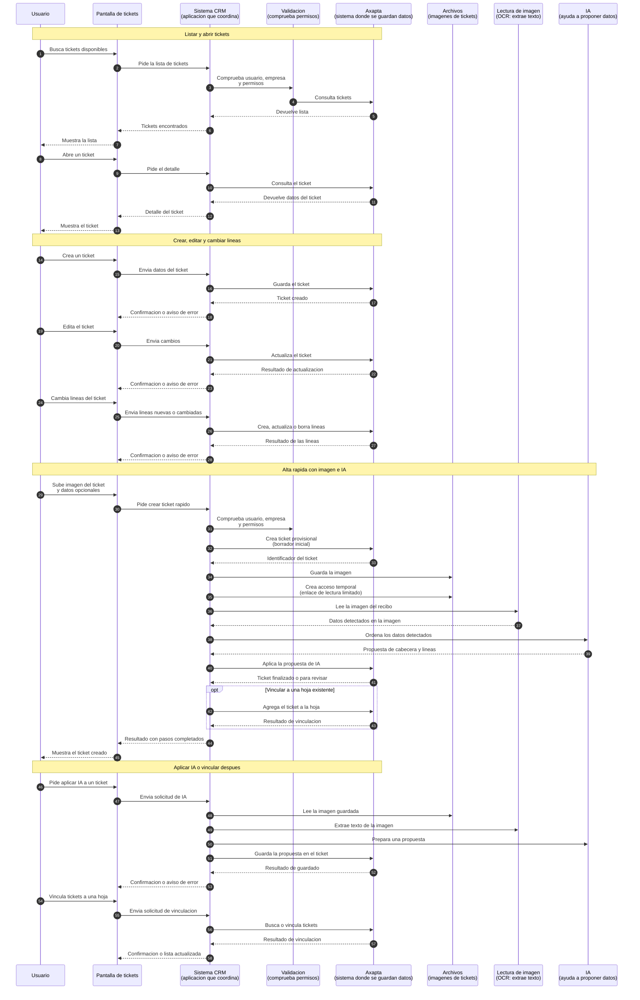

# User flow: tickets

Technical source: [tickets-sequence.md](../../technical/tickets/tickets-sequence.md)

This is the user-level version of the technical ticket diagram. It follows the
same operations, but uses business terms and explains technical words in
parentheses.

## User-level explanation

The user can list, open, create, update, and link tickets. The AI-assisted
parts use OCR, which means reading text from an image, and IA, which proposes
structured ticket data that the system can save or leave for manual review.
